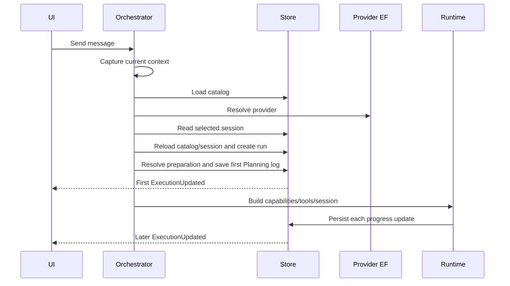

# C# Current-State Inventory

## Canonical models and projections

| Concern | Current owner | Canonical status | Architectural issue |
| --- | --- | --- | --- |
| Agent catalog, chat sessions, execution runs | `CanDoItAll.AgentFramework.Persistence` file stores | Canonical persisted state | Startup rereads catalog/session and persists before first feedback. |
| Provider profiles | Infrastructure EF/control-plane services | Canonical persisted state | Provider lookup is awaited before an operation event; fallback can reread catalog. |
| Execution run/detail/log | Agent Framework Persistence/Models/Core | Canonical durable run history | No pre-run operation identity; notification occurs after save. |
| `ExecutionEvent` | Agent Framework Core/Hosting | Diagnostic projection | Bounded/null sink paths mean it is not durable or canonical. |
| `ExecutionUpdated` | Workspace service .NET event | Compatibility live projection | Synchronous throwing multicast, tied to run ID, profile relay leakage. |
| Completion hub | Agent Framework Module | Invalidation signal only | Source-only routing, no context version/ordering/backpressure. |
| `BufferedAgentExecutionEventSink` | Agent Framework Core/Hosting | Diagnostic projection | No subscriptions/partition, silently bounded, bypassed in current-profile factory. |
| `IActivityStream` | SharedKernel | Persisted business/user activity boundary | Stringly request and wrong durability/semantics for runtime feedback. |
| `AgentChatContextRegistry` | Agent Framework Core | Canonical scoped live-context publication boundary | Good base; it currently carries prompt fragments only, lacks tool attachments/freshness/coverage, and its registry version is not a domain or concurrency version. |
| Project/process UI projections | Owning modules | Canonical read models for the current UI | Immediate facts exist but are not consistently revisioned/correlated with execution. |
| `AgentChatPreparationPool` | Agent Framework Module | Scoped metadata reuse | Name implies more than it does; cached definitions can expose mutable lists. |

## Construction and lifecycle

- The module-integrated web path registers `MafAgentRuntime`, workspace services, context registry, preparation pool, activity consumers, and tool providers as scoped; generic hosting has a separate singleton runtime composition path. This initiative must not conflate or capture either runtime in the singleton activity stream.
- Many MAF collaborators are singleton and stateless or concurrency-governed.
- `AgentFrameworkWorkspaceService` manually constructs execution/catalog services.
- `CanDoItAllAgentWorkspaceFactory` also manually creates runtime/store/workspace service instances and uses an unsynchronized scoped dictionary.
- Actual runtime composition is per execution and owns disposables.
- Current profile relay retains old workspace subscriptions until the scope dies.

## Critical sequence

The perceived freeze is everything before the first dashed response.

## Existing good patterns to preserve

- Context registry captures copied fragments under a lock with version and time.
- Preparation-pool invalidation fences stale in-flight results.
- Module completion handlers generally reload canonical data rather than applying AI payloads.
- Process projections already expose reusable selected-run/shell facts.
- Split-store initialized reads avoid cross-process locking.
- Provider services create EF contexts through factories.

## Root causes

1. Operational feedback is modeled as a persisted run log, so it cannot exist before a run and is storage-gated afterward.
2. Process manager chat bypasses the orchestrator/live update route.
3. Startup performs duplicated catalog/session reads and serializes independent provider/session work.
4. “Prepared agent” is only metadata and is not transitively immutable.
5. Runtime composition measurements exist but are discarded and lack execution correlation.
6. Event identities and lifecycle rules are too weak for direct UI/API projection.
7. Shared-load cancellation, workspace creation, and event relays have concurrency defects.

## Performance anti-pattern scan focus

The initiative does not perform a repository-wide mechanical performance rewrite. Targeted scans/review cover:

- sync-over-async and `async void` in the startup path;
- repeated enumeration/LINQ only in measured hot methods;
- per-call collection/string/JSON options only where measurements identify allocation pressure;
- file I/O mode and repeated reads in the split-store critical path;
- unbounded queues/handlers and unsafe task parallelism;
- EF tracking/projection/query shape for provider/process reads.

Unrelated style and leaf-class sealing findings are excluded unless a touched hot path has measured impact.
