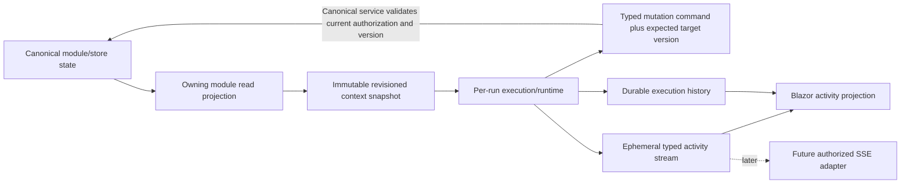

# C# Boundary Map

## Target ownership

| Boundary | Owns | Must not own |
| --- | --- | --- |
| `CanDoItAll.SharedKernel` | Generic typed sequenced-stream contracts/primitive, sequence/gap mechanics | Agent phases, UI, authorization policy, persistence, SSE DTOs |
| `CanDoItAll.AgentFramework.Models` | Agent operation/activity/snapshot value types and enums | DI, event storage, callbacks, EF, UI text policy |
| `CanDoItAll.AgentFramework.Core` | Agent activity coordinator/reader, lifecycle validation, operation correlation, execution/preparation contracts | Blazor rendering, authorization facade, provider implementation, file/EF implementation |
| `CanDoItAll.AgentFramework.Persistence` | Canonical catalog/session/run durability and efficient slice reads | Operational subscriber routing |
| `CanDoItAll.AgentFramework.Maf` | Per-run runtime materialization and correlated composition/provider measurements | Long-lived live-agent pooling, UI subscription |
| `CanDoItAll.Modules.AgentFramework` | Singleton stream composition, scoped authorized reader facade, scoped preparation service, floating orchestration | Canonical process/project data or activity sequencing |
| Project/Process owning modules | Immutable typed context attachments registered through the existing context registry and UI orchestration | Independent context snapshot stores, agent runtime internals, global event transport |
| Blazor components/AppComponents | Render typed projection and dispatch user intent | Storage/provider/context-building policy |
| Web API later | Authorization and versioned SSE projection | Canonical event storage or unrestricted stream access |

## Source-of-truth flow

The only write edge is a typed command through the owning canonical service. A snapshot may supply an expected target version but is never merged, replayed, or applied as authoritative state. No edge flows from `Activity`, `UI` projection state, or future `SSE` into canonical module data.

## Public contract rules

- Every stream partition is a validated value type, not an arbitrary topic string.
- Partition identity contains stable database-profile/workspace scope plus operation ID only; agent/session/run/context metadata may become known later.
- Operation identity exists before execution identity.
- The primitive is the sole sequence authority; operation coordinator is the sole phase/run-binding/terminal authority.
- Context identity includes source, scope, version, capture time, and digest where available.
- Activity phase/state is enum-driven; message text is display-only.
- Reader gaps, completion, cancellation, and disposal are explicit.
- A subscriber cannot mutate a published envelope or its collections.
- Completion notifications remain invalidation hints; current canonical state is reloaded and fenced by current revision.

## DI lifecycle rules

- Generic partition state and agent coordinator are singleton-safe, contain no scoped captures, never idle-evict active operations, and enforce bounded terminal/tombstone TTL/count plus a global partition limit with typed capacity rejection.
- Scoped authorized reader facades filter stable profile/workspace partitions and never expose the singleton globally.
- Per-operation lifecycle leases are transient objects created by the coordinator.
- Preparation is scoped and single-flight; its shared load lifetime is service-owned, while waiter cancellation is per caller.
- Runtime materialization and disposables remain per execution.
- EF reads use factory-created contexts; no context crosses a task boundary concurrently.
- Profile-switch notification invalidates preparation and detaches old workspace event relays.

## Extension model

A new module reuses the generic sequenced primitive only through its own typed event and partition contracts. It does not subscribe to a global untyped event bag. External transports adapt the typed reader after authorization and never become dependencies of producers.
