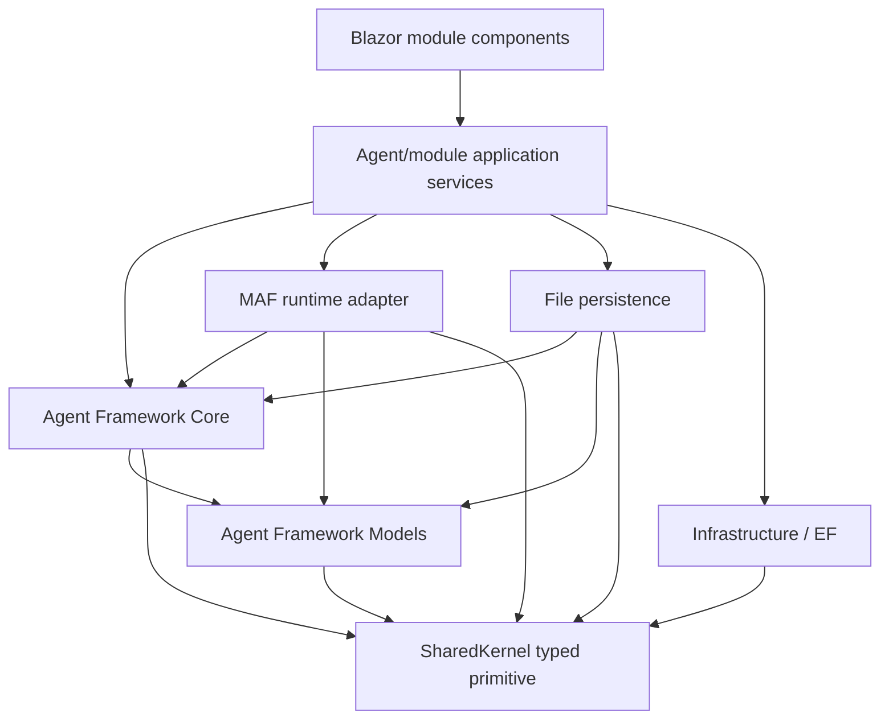

# C# Dependency Direction

## Allowed direction

## Forbidden direction

- SharedKernel must not reference Agent Framework or any module.
- Models must not reference Core, Module, Infrastructure, Blazor, or a callback service.
- Core must not reference Module, Infrastructure implementation, or Blazor.
- Persistence must not publish directly to UI.
- Project/Process domain/application layers must not reference Blazor components.
- The future SSE/API adapter must not be referenced by Core or producers.

## Planned dependency changes

- Prefer placing the generic stream primitive in the already-referenced SharedKernel to avoid a new project.
- If Core uses SharedKernel types directly, add an explicit project reference rather than relying on a transitive Models reference.
- Agent activity domain types stay in Models; Core owns behavior/interfaces.
- Module.AgentFramework composes the singleton stream/coordinator and supplies its required Core interface to every manually created workspace; it separately composes scoped authorized readers and scoped preparation.
- Process UI already references Module.AgentFramework/Core and requires no reverse reference.

## Manual-construction audit

Before changing constructors, enumerate all direct `new AgentFrameworkWorkspaceService`, `new AgentFrameworkWorkspaceExecutionService`, and relevant factory calls. Every production path must receive the same real activity coordinator. Tests must choose an explicit test collector or explicitly named disabled test policy; no optional constructor silently drops activity. Existing large execution partial files receive only small instrumentation calls; lifecycle/sequencing belongs in the separate coordinator, not another execution-service partial.

## Gate

Run a targeted CodeAnalytics dependency snapshot before SB02 and after SB03/SB06. Any new cycle, UI-to-persistence shortcut, or SharedKernel domain dependency blocks progression.
