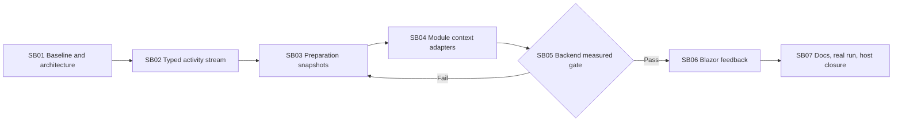

# Phase Plan

## Phase Sequence

1. Capture the current dependency/behavior snapshot and no-cost performance baseline; finalize architecture contracts.
2. Implement and prove the typed agent operational activity stream.
3. Implement immutable revisioned runtime-preparation blueprints and fix shared-load/construction lifecycle defects.
4. Standardize project/process current-context snapshots and remove/coalesce duplicate startup I/O.
5. Run the governed backend performance/concurrency gate. Stop here if improvement or correctness proof is insufficient.
6. Project typed activity into floating and process-manager Blazor surfaces and validate with components/browser.
7. Update product and SharedInfo docs/skills, run one `gpt-5.4-mini` agent validation, rebuild, restart port 5032, and close the bundle.

## Subbundle Dependency Map

## Critical Subbundles

- SB01 — `Governed`, critical foundation. Architecture gate and baseline must pass before source edits.
- SB02 — `Governed`, critical foundation. Stream ordering/isolation/gap/lifecycle proof gates every producer and consumer.
- SB03 — `Governed`, critical foundation. Immutability/invalidation/resource-lifecycle proof gates module adapters.
- SB04 — `Behavioral`, critical context integration. Concurrent/stale positive and negative proof gates measurement.
- SB05 — `Governed`, hard backend-to-UI gate. Required go/no-go record names measured improvements and unresolved regressions.
- SB06 — `Behavioral`, UI consumer phase. Component and large-screen browser proof gate documentation closure.
- SB07 — `Governed`, final closure. Documentation, real mini-model run, build/test, architecture review, and host health all pass.

## Phase Gates

- Preparation: bundle validator `prepared`, self-review, and C# architecture readiness decision are `Pass`.
- Per subbundle: validate prerequisites and no new workspace changes invalidate ownership.
- After governed subbundles: proof manifest, failing/passing transcripts, architecture snapshot, semantic/adversarial matrix, anti-stub audit, and progression decision exist.
- Backend-to-UI: SB05 must show immediate first activity, corrected startup operation counts, no concurrency/source-of-truth failure, and documented timing improvement.
- UI: screenshots and DOM assertions are reviewed, not merely captured.
- Closure: rerun bundle validator, architecture review, builds/tests, docs validators, SharedInfo checks, real mini-model sample, and port-5032 health.

## UI Target Policy

- CanDoItAll applications target large-screen desktop viewports. Do not add small/medium/mobile tuning unless explicitly requested.
- Reusable basic `CanDoItAll.Components.BaseLib` work validates small, medium, and large viewports.
