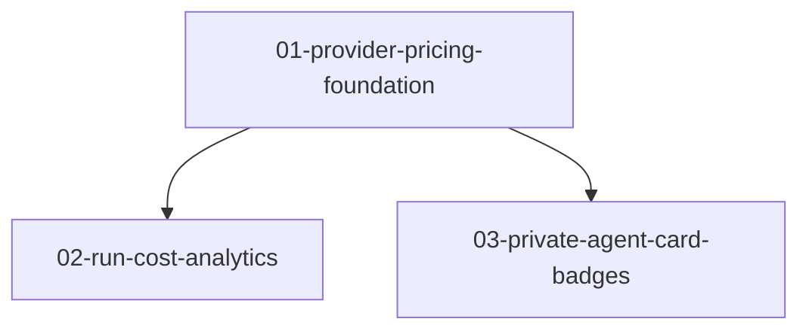

# Phase Plan

## Execution Order

1. Implement `01-provider-pricing-foundation`.
2. Implement `02-run-cost-analytics`.
3. Implement `03-private-agent-card-badges`.

## Subbundle Dependency Map

## Critical Subbundles

- SB01 is critical because downstream costing and UI classification must not infer from untyped JSON.
- SB02 is critical because it changes user-visible process cost semantics.

## Phase Gates

- Entry gate for SB01: provider and editor models have been inspected and the OpenAI source prices are captured.
- Closure gate for SB01: provider pricing defaults and override validation have focused tests.
- Closure gate for SB02: process/live analytics cost paths have focused tests or source-backed proof.
- Closure gate for SB03: at least one component or source assertion proves the private badge is wired from provider state.
