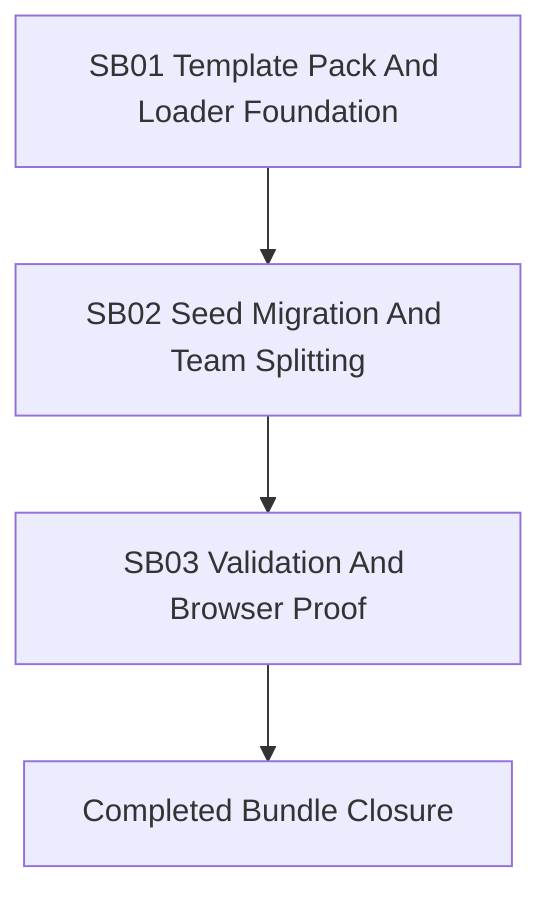

# Phase Plan

## Phase Sequence

1. SB01: Build the editable `Templates/Agents` pack and loader foundation.
2. SB02: Migrate seed generation and normalization to file-backed templates and seeded teams.
3. SB03: Run build/test/source/browser validation and close proof.

## Subbundle Dependency Map

- SB01 unlocks all downstream work because the template pack is the new source of truth.
- SB02 depends on SB01 and must prove production seed code consumes the templates.
- SB03 depends on SB02 and must prove tests and browser-visible behavior.

## Critical Subbundles

- SB01 is critical foundation work: template files and loader parsing must be complete before seed code can move.
- SB02 is critical migration work: default-agent hardcoding removal and seeded team merge logic determine runtime behavior.
- SB03 is critical closure work: build, tests, source audit, and Playwright/browser evidence are required before claiming parity.

## Phase Gates

- Gate after preparation: run `python C:\Users\dell\.codex\skills\candoitall-bundle-preparation\scripts\validate_bundle.py --profile initiative --stage prepared .codex\bundles\agent-template-teams`.
- Gate after SB01: template pack loads with every agent having instructions, provider key, and capability keys.
- Gate after SB02: production seed code materializes default agents/teams from templates and source audit shows no obsolete hardcoded default-agent assets.
- Gate after SB03: targeted `dotnet build`, targeted integration tests, browser validation, and completed-stage bundle validation pass.
