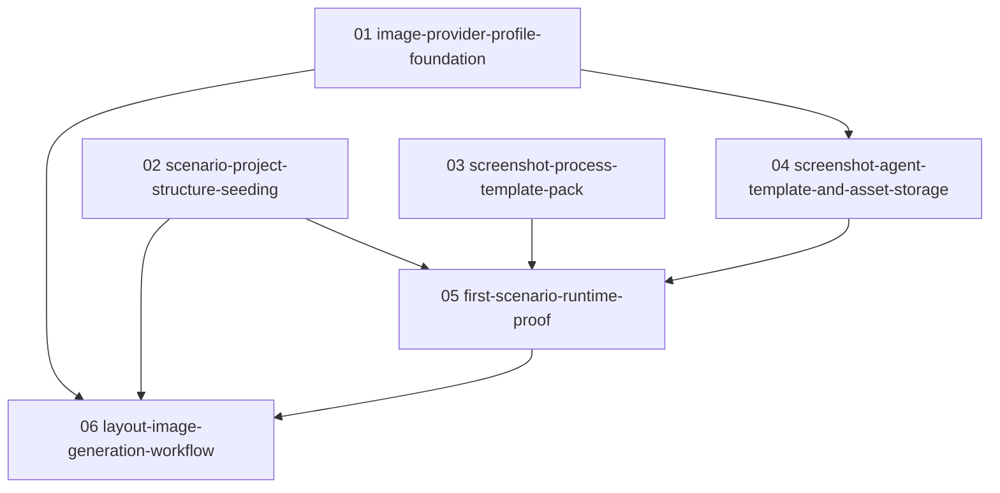

# Phase Plan

## Execution Order

1. `01-image-provider-profile-foundation`
2. `02-scenario-project-structure-seeding`
3. `03-screenshot-process-template-pack`
4. `04-screenshot-agent-template-and-asset-storage`
5. `05-first-scenario-runtime-proof`
6. `06-layout-image-generation-workflow`

## Subbundle Dependency Map

## Critical Subbundles

- `01-image-provider-profile-foundation` is a critical foundation because all image generation and per-agent provider preference depends on typed provider/agent metadata.
- `03-screenshot-process-template-pack` is a critical foundation because runtime proof is only meaningful if the templates express the right roles, steps, and artifact expectations.
- `04-screenshot-agent-template-and-asset-storage` is a critical foundation because screenshots must be reviewed and stored as image assets, not just created as loose files.
- `05-first-scenario-runtime-proof` is process-critical closure because it proves the generic process system can actually run the first screenshot workflow.

## Phase Gates

| Phase | Entry gate | Closure gate | Downstream dependency |
| --- | --- | --- | --- |
| 01 | Repo provider/agent model files identified and current seed behavior understood. | Build/tests pass; provider and agent metadata read/write proof exists; no process-core special cases added. | 04 and 06 require preferred image provider metadata. |
| 02 | Scenario inventory confirmed from `run-manifest.json` and scenario source files. | Three project structures read back with required nodes and delivery block text. | 05 and 06 consume project nodes and asset targets. |
| 03 | Template-pack shape and import path understood. | New process templates validate, list, and import through process APIs. | 05 needs runnable screenshot template. |
| 04 | Provider/capability foundation exists. | Agent templates read back with Playwright MCP, storage, project-structure, process, and image-provider access. | 05 needs screenshot/review agents. |
| 05 | 02, 03, and 04 closure gates pass. | Scenario 01 screenshot process run captures, reviews, stores, and reads back the screenshot asset. | 06 uses stored screenshot asset references. |
| 06 | 01 and 05 closure gates pass. | Layout-generation process produces image asset nodes or records explicit OpenAI credential/model blocker. | Final closure. |
