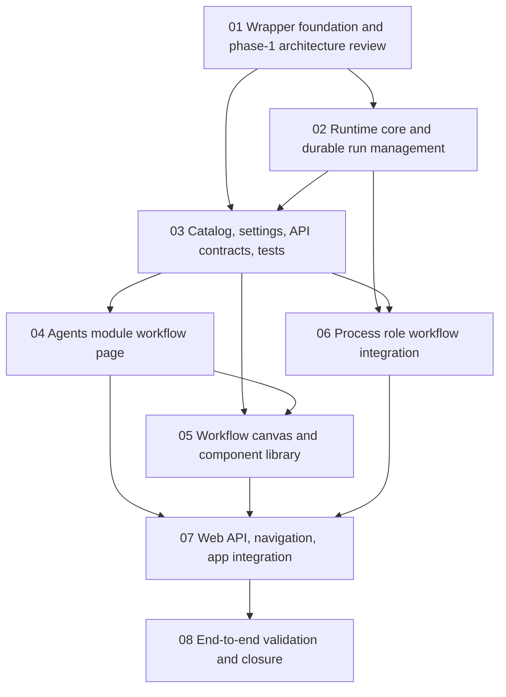

# Phase Plan

## Execution Order

| Order | Subbundle | Phase | Purpose |
| --- | --- | --- | --- |
| 1 | `01-maf-workflow-wrapper-foundation-and-architecture-review` | Phase 1 foundation | Define models, wrappers, MAF mapping strategy, and detailed architecture review gate. |
| 2 | `02-workflow-runtime-core-and-durable-run-management` | Phase 1 foundation | Implement product run management around MAF execution primitives and evaluate/prefer MAF DurableTask/DTS for durable execution. |
| 3 | `03-workflow-catalog-settings-api-and-tests` | Phase 2 workflow platform | Add workflow definition/settings/component/test service/API foundations. |
| 4 | `04-agents-module-workflows-page` | Phase 2 Agents module | Add separate Workflows page in the existing Agents module. |
| 5 | `05-workflow-canvas-editor-and-component-library` | Phase 2 Agents module | Add workflow canvas editing and prepared component library UI. |
| 6 | `06-process-role-workflow-integration` | Phase 3 process integration | Allow process roles to choose workflow executors with strong typing. |
| 7 | `07-web-api-navigation-and-app-integration` | Phase 3 web integration | Wire API routes, navigation, app services, and cross-surface integration. |
| 8 | `08-end-to-end-validation-architecture-review-and-closure` | Closure | Prove build, tests, browser flows, API flows, architecture reviews, and raw note closure. |

## Subbundle Dependency Map

## Critical Subbundles

- `01-maf-workflow-wrapper-foundation-and-architecture-review` is a critical foundation. If it fails, all later persistence, API, UI, and process integration work is likely to encode the wrong model.
- `02-workflow-runtime-core-and-durable-run-management` is a critical runtime foundation. If it cannot prove the DurableTask/DTS decision, durable events, checkpoints, external requests, cancellation, resume, and performance-safe event/status paths, workflow UI and process integration are not safe to build.
- `05-workflow-canvas-editor-and-component-library` is a critical UI foundation. It determines whether workflow authoring is typed and testable or degenerates into arbitrary graph JSON.
- `06-process-role-workflow-integration` is process-critical. It must preserve process orchestration semantics and strongly typed executor selection.

## Phase Gates

- Phase 1 gate: subbundles 01 and 02 complete, detailed architecture review recorded, runtime ownership decided, DurableTask/DTS hosting decision recorded, MAF mapping proven, performance hot-path review recorded, and no unresolved blocking review finding remains.
- Phase 2 gate: subbundles 03, 04, and 05 complete, workflow settings/testing/canvas UI are browser-proven, component library can build at least one LLM call workflow, and architecture review approves UI/domain separation.
- Phase 3 gate: subbundles 06 and 07 complete, process role workflow execution is proven through API/UI or integration test evidence, and process remains the owner of orchestration.
- Closure gate: subbundle 08 proves full build/test/browser/API coverage, updates `reviews/01-execution-report.md`, closes every raw note, and documents final architecture review results.
