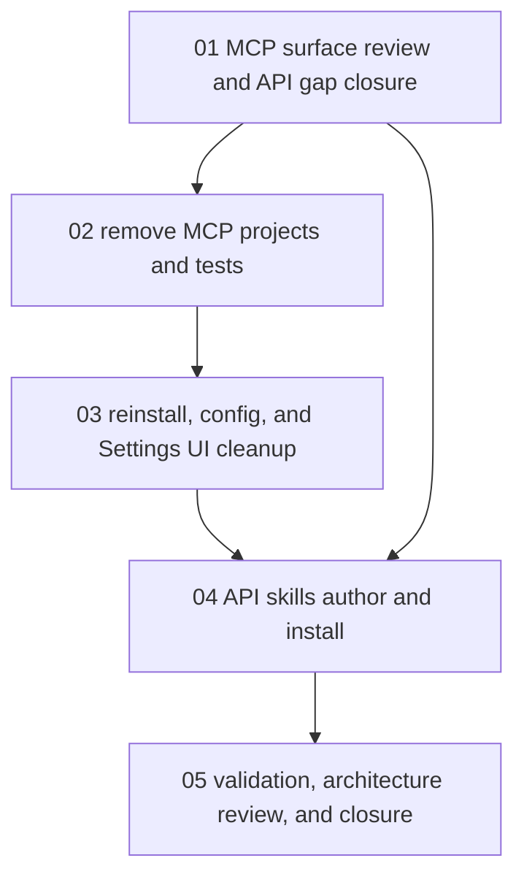

# Phase Plan

## Phase Sequence

1. Prepare and validate this cleanup bundle.
2. Close API parity gaps and route naming drift found during MCP surface review.
3. Remove the ProjectStructure and Processes MCP projects, dedicated tests, and active references.
4. Clean reinstall scripts, config files, local Codex config, and MCP-specific Settings UI.
5. Add and install repo-managed API skills.
6. Run validation, architecture review, raw-note closure, and final bundle closure gate.

## Subbundle Dependency Map

## Critical Subbundles

- `01-01-mcp-surface-review-and-api-gap-closure` is a critical foundation because it preserves useful MCP behavior before deletion.
- `02-02-remove-projectstructure-processes-mcp-code` is a critical removal step because downstream script cleanup assumes those projects are gone.
- `04-04-api-skills-author-install` is a critical replacement step because it is the user-facing path for future project/process/agent API work.

## Phase Gates

- Prepared gate: `validate_bundle.py --profile initiative --stage prepared` passes.
- Subbundle 01 entry: bundle prepared; closure requires API gap notes and implemented process parity endpoints or a documented blocker.
- Subbundle 02 entry: subbundle 01 closed; closure requires solution/project/test references cleaned.
- Subbundle 03 entry: subbundle 02 closed; closure requires reinstall/config/UI references cleaned.
- Subbundle 04 entry: subbundle 01 and 03 closed; closure requires repo skills and installed user skills.
- Subbundle 05 entry: subbundles 01 through 04 closed; closure requires build/test proof, source searches, architecture review, and final validator.
