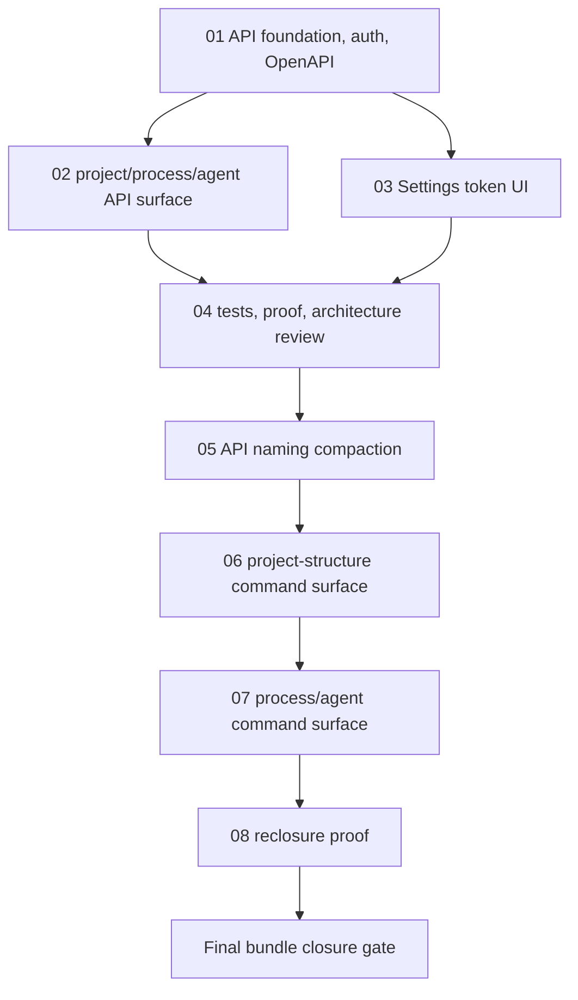

# Phase Plan

## Phase Sequence

1. Prepare and validate this bundle.
2. Implement API foundation, OpenAPI mapping, optional JWT validation, and route-group auth helper.
3. Implement project, process, and agent endpoint groups using existing services.
4. Add Settings API access tab and token issuer UI.
5. Compact the API naming so introduced code and operation names do not use `Development`.
6. Add focused project-structure command endpoints through existing services/shared helpers.
7. Add focused process and agent command/filter endpoints.
8. Run tests/builds, perform architecture review, record proof, and close raw notes.

## Subbundle Dependency Map

- The foundation subbundle must pass before endpoint and Settings work starts because both depend on options, auth, and token issuer contracts.

## Critical Subbundles

- `01-01-api-foundation-auth-swagger` is a critical foundation. Required proof: options/token tests, JWT-enabled anonymous rejection, JWT-disabled anonymous success, and OpenAPI endpoint smoke.
- `02-02-project-process-agent-api-surface` is a critical functional foundation. Required proof: endpoint source review confirms service reuse, process filtering test passes, and project/process/agent representative route tests pass.
- `06-06-project-structure-command-surface` is a critical correction foundation. Required proof: command endpoints reuse project-structure/workbench services and do not duplicate UI/MCP business logic.

## Phase Gates

- Prepared gate: `validate_bundle.py --stage prepared` and manual coverage audit pass.
- Subbundle 01 entry: no prerequisites beyond prepared bundle; closure blocks all downstream work.
- Subbundle 02 entry: Subbundle 01 completed; closure requires architecture review row before UI work if endpoint handlers show duplication risk.
- Subbundle 03 entry: Subbundle 01 completed; closure requires Settings component/browser proof or documented launch blocker.
- Subbundle 04 entry: Subbundles 01-03 completed or explicitly reopened; closure records original proof but no longer closes the bundle after the 2026-05-05 correction.
- Subbundle 05 entry: Subbundles 01-04 exist; closure requires source search for rejected naming.
- Subbundle 06 entry: Subbundle 05 completed; closure requires service-reuse review for project-structure commands.
- Subbundle 07 entry: Subbundle 06 completed; closure requires focused process/agent route proof.
- Subbundle 08 entry: Subbundles 05-07 completed or explicitly blocked; closure requires final validator and raw-note closure table.
