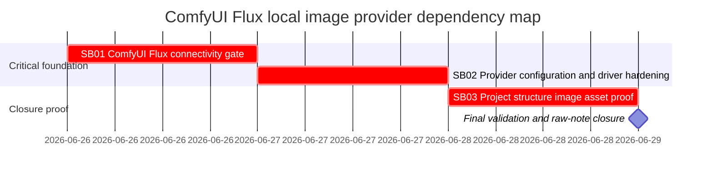

# Phase Plan

## Phase Sequence

1. SB01 proves live ComfyUI Flux connectivity with the provided sample/testbed and stops the workflow if it cannot generate and download an image.
2. SB02 implements the minimal driver/provider seed improvements needed for a durable Flux provider configuration.
3. SB03 proves that project-structure image asset creation can use the ComfyUI Flux provider and store generated bytes.
4. Final closure reruns validators, audits raw notes, and records any unresolved environment blockers.

## Subbundle Dependency Map

- SB02 must not start unless SB01 proves live Flux generation or records an honest blocker.
- SB03 must not start unless SB02 tests and source assertions prove that the ComfyUI provider path is real and explicit.

## Critical Subbundles

- SB01 is a critical foundation because downstream code changes are invalid without live ComfyUI Flux generation proof.
- SB02 is a critical foundation because downstream project-structure proof depends on the provider configuration and driver behavior.
- SB03 is critical closure because it proves the user-facing project-structure image generation requirement.

## Phase Gates

- Gate after preparation: run `scripts/validate_bundle.py --stage prepared --profile initiative` and repair any failures.
- Gate before SB01: confirm the sample workflow file and copied bundle artifact exist.
- Gate after SB01: require a command transcript, generated image artifact, workflow node assertion, and explicit continue-or-stop decision.
- Gate before SB02: require SB01 `Completed`; if SB01 is `Blocked`, stop without production code changes.
- Gate after SB02: require focused unit/integration tests, source assertions, anti-stub audit, and proof manifest before SB03 starts.
- Gate before SB03: require SB02 `Completed` and a usable ComfyUI Flux image provider profile.
- Gate after SB03: require project-structure asset proof, content byte proof, analytics/gate rows, and raw-note closure.
- Gate before closure: run completed-stage bundle validation and reopen any subbundle with weak proof.
