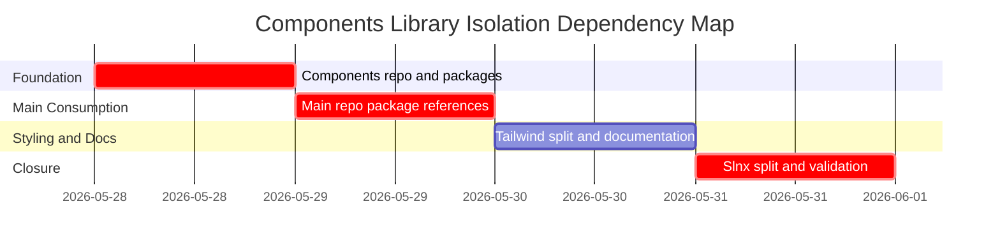

# Phase Plan

## Phase Sequence

1. Build the components repo foundation: move project folders, create solution/package metadata, update component Tailwind, and build/pack packages.
2. Convert the main repo to package consumption: add local package source, packages, and replace moved-component project references.
3. Split Tailwind and documentation: keep CanDoItAll-specific CSS in the main repo, wire the second output, and document both workflows.
4. Update solution membership and validate: remove moved/Space3D projects from main slnx, add Space3D slnx, run builds/tests, and close raw notes.

## Subbundle Dependency Map

## Critical Subbundles

- `SB01` / `01-components-repo-foundation` is critical because all package consumption depends on correct moved source, package metadata, and generated packages.
- `SB02` / `02-main-repo-nuget-consumption` is critical because it proves isolation. Any direct project reference to a moved component invalidates the goal.
- `SB04` / `04-solution-validation` is critical because it proves the main solution is lighter and still builds.

## Phase Gates

- Gate after preparation: run `validate_bundle.py --stage prepared` and repair structural failures before implementation.
- Gate before SB01: confirm both worktrees are clean enough to distinguish intentional moves.
- Gate after SB01: components solution builds, packages exist, and each moved project has package metadata/readme.
- Gate before SB02: packages are copied to `ExternalPackages`.
- Gate after SB02: main repo restore/build no longer needs moved source folders.
- Gate after SB03: both Tailwind outputs build and docs describe the split.
- Final gate after SB04: `CanDoItAll.slnx` excludes moved components and Space3D, Space3D has its own slnx, build/test proof is recorded, and raw notes close.
