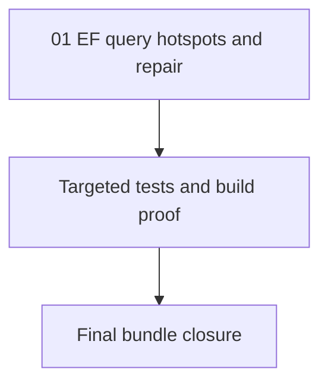

# Phase Plan

## Execution Order

1. `01-ef-query-hotspots-and-repair`

## Subbundle Dependency Map

## Critical Subbundles

- `01-ef-query-hotspots-and-repair`: Critical foundation. It owns the only implementation phase and the validation proof for this bundle.

## Phase Gates

| Phase | Gate |
| --- | --- |
| Preparation | Prepared-stage validator passes before implementation edits are treated as bundle-backed execution. |
| Entry | Source files listed in the subbundle still exist and the worktree dirty files are unrelated. |
| Closure | Targeted tests/build pass, execution report is updated, and raw notes are closed. |

