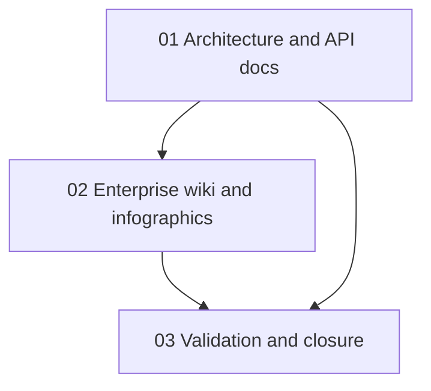

# Phase Plan

## Phase Sequence

1. Prepare and validate the docs refresh bundle.
2. Update architecture, README, API, and retired-MCP technical docs.
3. Generate and save enterprise infographic assets, then add customer-facing wiki content.
4. Run documentation validation, stale-reference searches, bundle closure audit, and final validators.

## Subbundle Dependency Map

## Critical Subbundles

- `01-architecture-api-doc-refresh` is the critical foundation because customer-facing docs depend on the corrected API/MCP/architecture truth.
- `02-enterprise-wiki-and-infographics` is customer-facing and must not close until all four image files exist in the repo and are referenced.
- `03-validation-and-closure` is the closure gate because it checks bundle consistency, stale MCP wording, and Markdown hygiene.

## Phase Gates

- Prepared gate: `validate_bundle.py --profile initiative --stage prepared .codex/bundles/docs-enterprise-refresh` passes.
- Subbundle 01 entry: prepared gate passes; closure requires architecture/API docs edited and stale active MCP setup wording removed.
- Subbundle 02 entry: subbundle 01 completed; closure requires four `docs/images` assets and customer-facing docs referencing them.
- Subbundle 03 entry: subbundles 01 and 02 completed; closure requires validation commands and raw-note closure rows.
- Final closure gate: `validate_bundle.py --profile initiative --stage completed .codex/bundles/docs-enterprise-refresh` passes.
