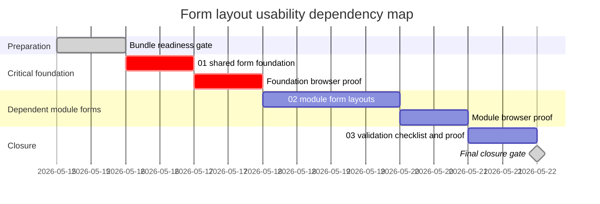

# Phase Plan

## Phase Sequence

1. Prepare and validate this bundle, including inventory and proof rules.
2. Execute `01-01-shared-form-foundation`: improve shared field stretching, textarea defaults, and section affordance.
3. Validate the shared foundation in the inputs sandbox and one real module form before moving on.
4. Execute `02-02-module-form-layouts`: apply targeted topical grouping and width fixes to high-density product forms.
5. Execute `03-03-validation-checklist-and-proof`: finish screenshots, generated proposals, workbook, comparison rows, and final validators.

## Subbundle Dependency Map

## Critical Subbundles

- `01-01-shared-form-foundation` is critical because all module form proofs rely on shared field width and textarea behavior.
- Deeper validation required: build, shared inputs sandbox screenshot, one modal/form route screenshot, and check that explicit larger textareas still keep their larger sizing.

## Phase Gates

- Gate after preparation: run `scripts/validate_bundle.py --stage prepared` and manually verify raw request coverage.
- Gate before subbundle 01: source references exist and no component MCP data is required to proceed.
- Gate after subbundle 01: build passes and screenshots show shared controls stretch and textareas are readable.
- Gate before subbundle 02: foundation proof is not contradicted by module screenshots.
- Gate after subbundle 02: every targeted module row has implementation proof and screenshot comparison status.
- Gate before closure: workbook exists, proposal images exist, browser analytics rows are complete, and raw-note closure is not pending.
