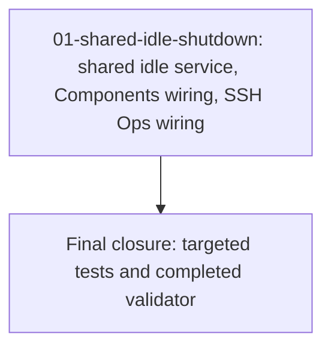

# Phase Plan

## Execution Order

1. `01-shared-idle-shutdown`
2. Final closure validation

## Subbundle Dependency Map

## Critical Subbundles

- `01-shared-idle-shutdown` is a critical foundation because it owns the shared lifecycle behavior for both requested MCPs. Weak proof here invalidates the entire request.

## Phase Gates

| Phase | Entry gate | Closure gate | Reopen trigger |
| --- | --- | --- | --- |
| `01-shared-idle-shutdown` | Bundle prepared validator passes and exact source references exist. | Targeted idle service tests pass, Components MCP tests pass, SshOps/unit build or tests pass, and both MCP projects build. | Any requested MCP can remain alive indefinitely after inactivity or can stop during an active tool call. |
