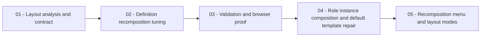

# Phase Plan

## Execution Order

1. `01-layout-analysis-and-contract`
2. `02-definition-recomposition-tuning`
3. `03-validation-and-browser-proof`
4. `04-role-instance-composition-and-default-template-repair`
5. `05-recomposition-menu-and-layout-modes`

## Subbundle Dependency Map

## Critical Subbundles

- `01-layout-analysis-and-contract`: Critical foundation. If it misidentifies the layout owner or graph semantics, implementation may tune the wrong surface.
- `02-definition-recomposition-tuning`: Critical UI foundation. Later browser proof is not trustworthy unless this phase preserves the step spine and semantic branch lanes.
- `03-validation-and-browser-proof`: Final closure. It decides whether the raw request is solved or only partially solved.
- `04-role-instance-composition-and-default-template-repair`: Reopened follow-up. It addresses the residual role-edge crossing problem by changing role rendering from one global hub to per-step visual role instances while keeping one role contract.
- `05-recomposition-menu-and-layout-modes`: Reopened follow-up. It fixes the detached recomposition menu interaction and adds operator-selectable graph modes for balanced flow, main-spine readability, branch fan-out, and feedback lanes.

## Phase Gates

- `01` may close when source references, requirements, and algorithm boundaries are documented against real repo files.
- `02` may start only after `01` passes. It may close when targeted component tests prove main path, branch lane, spacing, and role-anchor behavior.
- `03` may start only after `02` passes. It may close when tests/build and browser proof are recorded, or when an explicit browser blocker is documented with a follow-up path.
- `04` may start only after `03` proves the baseline recomposition and records the residual connector/role-link risk. It may close when surface tests prove duplicated role nodes, template coordinates are repaired, build/tests pass, and browser proof shows fewer long role spokes on a default complex process.
- `05` may start only after `04` proves per-step role placement. It may close when the toolbar menu floats without stretching, at least three selectable layout modes are wired through the UI, template coordinates are refreshed, tests/build pass, and browser proof records large-screen screenshots plus crossing-count analytics.
