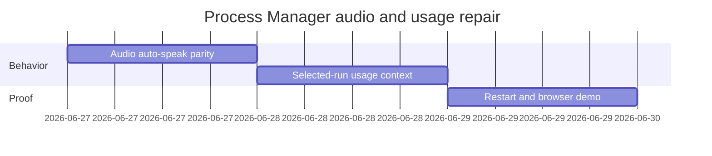

# Phase Plan

## Phase Sequence

1. Prepare and validate the feedback bundle.
2. Implement Manager audio auto-speak parity and targeted component proof.
3. Implement selected-run usage loading/prompt context and classifier proof.
4. Build, restart 5032, run browser proof, then update bundle execution report.

## Subbundle Dependency Map

- Audio and usage fixes are independent in code but both must pass before browser proof can honestly close the user feedback.

## Critical Subbundles

- `SB01-manager-audio-auto-speak-parity`: closes the missing automatic speech regression.
- `SB02-manager-selected-run-usage-context`: closes the missing cost/token manager context regression.
- `SB03-proof-restart-and-browser-demo`: proves the rebuilt 5032 instance and browser Manager tab.

## Phase Gates

- Gate after preparation: run the bundle validator and repair failures.
- Gate before each subbundle: confirm prerequisites are complete and still valid.
- Gate after each subbundle: capture proof, review screenshots, and decide whether downstream work may continue.
- Gate before closure: rerun validators, close raw notes, and reopen anything with weak proof.
