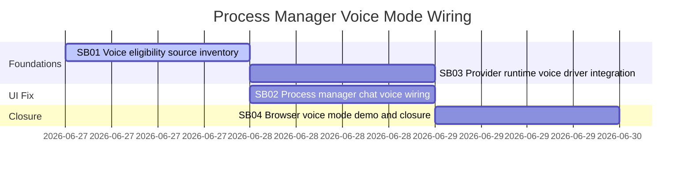

# Phase Plan

## Phase Sequence

1. SB01 inventories the voice eligibility path and records failing-first expectations.
2. SB02 wires Manager chat voice state and callbacks, then captures failing-first and passing component proof.
3. SB03 audits and proves provider runtime voice driver integration for STT and TTS.
4. SB04 runs browser validation on `/processes`, reviews screenshots, closes raw notes, and runs final validators.

## Subbundle Dependency Map

- SB03 is allowed to start after SB01 and before SB02 closes if execution time requires it, but SB04 cannot close until both SB02 and SB03 close.

## Critical Subbundles

- SB01 is a critical foundation because it defines the exact cause of the disabled buttons and the shared voice eligibility contract.
- SB02 is a critical UI foundation because it changes the user-visible Manager chat behavior and owns the raw bug.
- SB03 is a critical foundation because the user's prompt explicitly calls out provider/voice-driver refactor risk.
- SB04 is critical closure because it provides real rendered-app proof and raw-note closure.

## Phase Gates

- Gate after preparation: run `scripts/validate_bundle.py --stage prepared --profile initiative` and repair failures.
- Gate before SB01: confirm source files exist and no existing bundle already owns this defect.
- Gate after SB01: source inventory names the exact disabled-state owner and shallow-pass traps.
- Gate before SB02: SB01 must show the Manager chat owner currently omits `ChatWorkspacePanel` voice parameters.
- Gate after SB02: failing-first and passing component transcripts exist, source assertions show callbacks wired, and disabled-agent negative proof still passes.
- Gate after SB03: STT and TTS runtime driver transcripts exist and unsupported capability failure remains explicit.
- Gate before SB04: SB02 and SB03 closure gates pass.
- Gate before closure: Playwright proof, screenshot review, anti-stub audit, raw-note closure, proof manifests, and completed-stage validator all pass or blockers are recorded.
