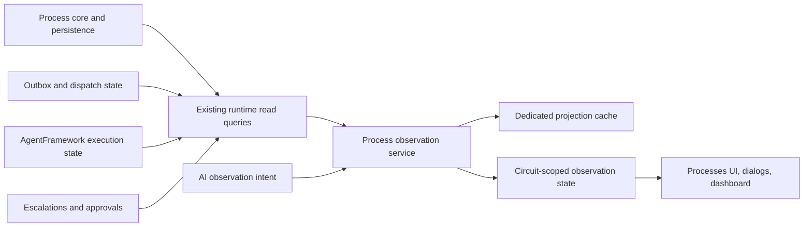

# Target Solution

## End State

The Processes module exposes a read-only observation boundary that the existing `ProcessWorkspace`, future dashboard surfaces, detail dialogs, and AI-driven UI focus controls can consume without each caller recomposing runtime state from `ProcessesService`, outbox, escalation journals, AgentFramework execution runs, and canvas state.

The process runtime remains the generic execution source of truth. Observation services are projections over persisted runtime state and related operational read models. They may cache, coalesce, page, and summarize reads, but they must never own process progression or silently replace failed source reads with stale data.

## Primary Boundary

## Proposed Production Types

- `IProcessObservationService`
  - `GetDashboardSnapshotAsync(ProcessObservationDashboardQuery query, CancellationToken cancellationToken)`
  - `GetRunSnapshotAsync(ProcessRunObservationQuery query, CancellationToken cancellationToken)`
  - `GetStageSnapshotAsync(ProcessStageObservationQuery query, CancellationToken cancellationToken)`
  - `GetTimelinePageAsync(ProcessObservationTimelineQuery query, CancellationToken cancellationToken)`
  - `GetDialogPayloadAsync(ProcessObservationDialogQuery query, CancellationToken cancellationToken)`
- `IProcessObservationInvalidator`
  - `NotifyDefinitionChanged(ProcessDefinitionObservationKey key)`
  - `NotifyRunChanged(ProcessRunObservationKey key)`
  - `NotifyProjectChanged(Guid projectId)`
  - `NotifyAgentExecutionChanged(Guid? processRunId, Guid? processStepRunId)`
- Snapshot and query records:
  - `ProcessDashboardObservationSnapshot`
  - `ProcessDefinitionObservationCard`
  - `ProcessRunObservationSummary`
  - `ProcessStageObservationSummary`
  - `ProcessObservationTimelineItem`
  - `ProcessObservationDialogDescriptor`
  - `ProcessObservationSnapshotRevision`
  - `ProcessObservationStaleness`

All public contracts should be strongly typed immutable records or readonly structs where appropriate. Use enums or typed keys for kinds, statuses, focus targets, and dialog payload types. Do not introduce stringly typed commands or arbitrary agent-facing UI actions.

## Read Shape

- Dashboard snapshots should contain bounded summary data for many processes: definition identity, activity status, current stage rollups, active run counts, stalled/error indicators, latest activity, and links to lazy detail descriptors.
- Run snapshots should contain selected-run details that are currently assembled by `ProcessWorkspaceRunDetailsLoader`, but shaped for dialog and panel use instead of page component state.
- Timeline reads must be paged and filterable. They should not materialize every event for every active process.
- Dialog payloads should be loaded on demand from typed descriptors. Opening a dialog is a projection read, not a mutation.

## Allowed Side Effects

- Observation services may log query failures, cache misses, stale-result decisions, cache invalidation, and slow projection reads with masked identifiers where needed.
- Observation services may invalidate local projection cache entries after authoritative writes complete.
- Observation services may update circuit-scoped UI state containers.

## Disallowed Side Effects

- Observation services must not start, stop, retry, approve, dispatch, or otherwise mutate process runs.
- Observation cache must not be written before the authoritative runtime write commits.
- UI and AI intent handling must not bypass existing authorization/project scoping.
- Cache fallback must not hide current source-read failures. If stale data is shown, the snapshot must expose staleness and the error state explicitly.

## Incremental Migration Strategy

1. Document and baseline the current page-local data flow before changing contracts.
2. Add observation contracts and projection service behind existing read services.
3. Add a dedicated cache wrapper and invalidation hooks.
4. Move existing `ProcessWorkspace` refresh and selected detail reads to the observation service in narrow slices.
5. Add typed AI observation intents only after the read-only boundary exists.
6. Validate end to end with integration tests, component tests, browser proof, mock-agent process runs, and independent simple .NET app build cases.
