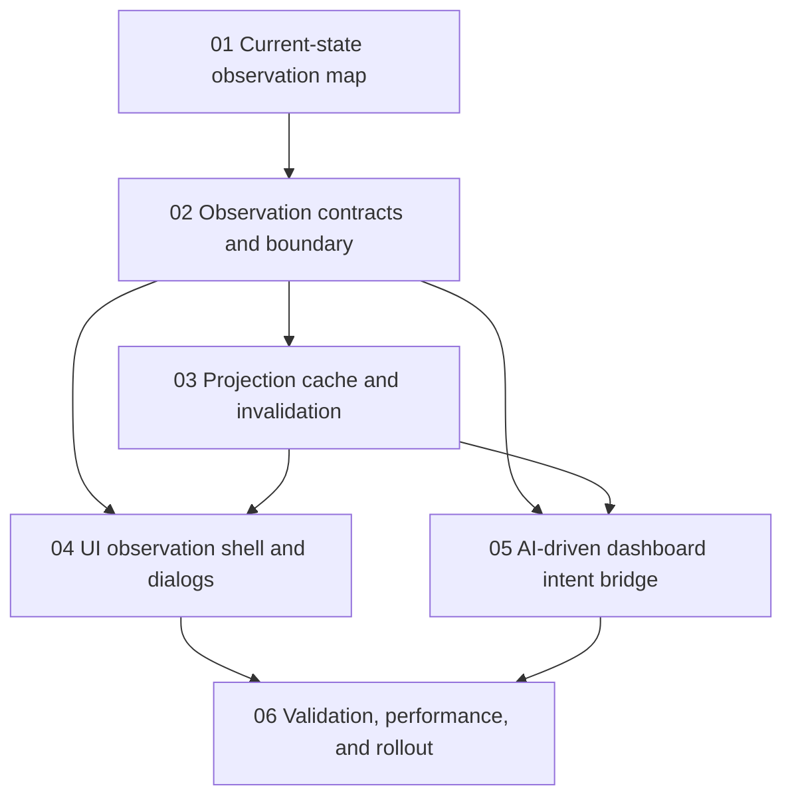

# Phase Plan

## Phase Sequence

1. Execute `01-current-state-observation-map` first. This is the foundation that prevents guessing about existing lazy loading, active-run summaries, and page refresh behavior.
2. Execute `02-observation-contracts-and-boundary` before any cache or UI work. The cache and UI must depend on typed read-only contracts, not component state.
3. Execute `03-projection-cache-and-invalidation` after the boundary exists. Cache behavior is meaningful only when the projected read shapes and keys are explicit.
4. Execute `04-ui-observation-shell-and-dialogs` after contracts and cache exist. This phase migrates existing UI slices without replacing the whole Processes page.
5. Execute `05-ai-driven-dashboard-intent-bridge` after contracts exist and preferably after cache policy is in place. The AI bridge must target typed observation intents only.
6. Execute `06-validation-performance-and-rollout` last. It proves behavior, performance, browser rendering, mock-agent workflows, generic process cases, and independent .NET build cases.

## Subbundle Dependency Map

## Critical Subbundles

- `01-current-state-observation-map` is a critical foundation. If the existing page refresh and lazy-loading behavior are mapped incorrectly, later phases can accidentally reintroduce overload.
- `02-observation-contracts-and-boundary` is a critical architecture foundation. If it leaks mutations, UI component state, or app-specific semantics, every dependent phase inherits that flaw.
- `03-projection-cache-and-invalidation` is process-critical. If cache policy creates a split source of truth, later UI and AI features will show misleading process state.
- `04-ui-observation-shell-and-dialogs` is a critical UI foundation. It proves the boundary can support the current page before any more ambitious dashboard work continues.

## Phase Gates

- Gate after preparation: run the bundle validator or a placeholder scan and repair all placeholders, missing proof sections, and unmapped requirements.
- Gate before each subbundle: confirm prerequisites, exact source references, and current git/worktree state.
- Gate after each implementation subbundle: update `reviews/01-execution-report.md` with commands, changed paths, proof artifacts, residual risks, and downstream progression decision.
- Gate after `03`: prove cache invalidation and stale/error behavior with tests before UI consumes cached projections.
- Gate after `04`: complete component tests and browser proof on `/processes`, including large and narrow viewport checks.
- Gate after `06`: rerun final validation, verify no raw note is unclosed, and either approve rollout or document exact blockers.

## Rollout Rule

Use a narrow rollout path. The first implementation should preserve existing direct read paths until the observation service has equivalent proof. If a feature flag or configuration toggle is added, it must be temporary, explicit, and included in the final cleanup/rollout decision.
