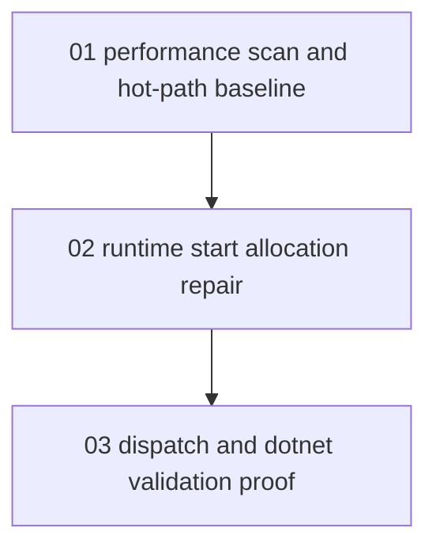

# Phase Plan

## Execution Order

1. `01-01-01-performance-scan-and-hot-path-baseline`: scan Processes module with the .NET performance recipes and identify hot-path findings.
2. `02-02-02-runtime-start-and-transition-allocation-repair`: implement the small runtime-start allocation repair and keep transition semantics stable.
3. `03-03-03-dispatch-and-dotnet-validation-proof`: run targeted tests, mock-agent proof, independent simple .NET app build cases, build proof, and closure audit.

## Subbundle Dependency Map

## Critical Subbundles

- `01-01-01-performance-scan-and-hot-path-baseline` is a critical foundation because later edits must be grounded in real hot-path signals.
- `02-02-02-runtime-start-and-transition-allocation-repair` is a critical foundation because it changes generic runtime assignment selection support.
- `03-03-03-dispatch-and-dotnet-validation-proof` is critical for closure because the user explicitly required functionality preservation and independent .NET app build smoke cases.

## Phase Gates

| Subbundle | Entry gate | Closure gate |
| --- | --- | --- |
| `01-01-01-performance-scan-and-hot-path-baseline` | Raw request is preserved and source files exist. | Scan counts and hot-path decision are recorded. |
| `02-02-02-runtime-start-and-transition-allocation-repair` | Subbundle 01 closure identifies a concrete runtime hot path. | Code compiles and targeted runtime behavior tests pass. |
| `03-03-03-dispatch-and-dotnet-validation-proof` | Runtime repair proof is strong enough to test downstream behavior. | Targeted process tests, mock-agent proof or explicit gap, independent .NET app build smokes, and final build proof are recorded. |
