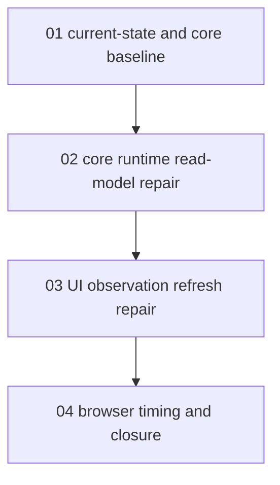

# Phase Plan

## Execution Order

1. `01-01-current-state-and-measurement`: confirm read path, capture baseline core timing, and identify measured bottlenecks.
2. `02-02-core-runtime-bottleneck-repair`: implement batched active-run health metrics and reduce repeated AgentFramework scans.
3. `03-03-ui-observation-bottleneck-repair`: reduce unnecessary refresh work in the Blazor observation loop.
4. `04-04-browser-measurement-and-closure`: run targeted tests, start the app, capture Playwright timing and screenshot proof, and close raw notes.

## Subbundle Dependency Map

## Critical Subbundles

- `01-01-current-state-and-measurement` is a critical foundation because later proof must compare against its baseline timing.
- `02-02-core-runtime-bottleneck-repair` is a critical foundation because the UI repair depends on cheaper process read models.
- `04-04-browser-measurement-and-closure` is critical for final acceptance because the user explicitly required Playwright response-time measurement.

## Phase Gates

| Subbundle | Entry gate | Closure gate |
| --- | --- | --- |
| `01-01-current-state-and-measurement` | Bundle source references exist and raw notes are mapped. | Baseline timing and bottleneck notes are recorded in the execution report. |
| `02-02-core-runtime-bottleneck-repair` | Baseline confirms active-run summary or refresh read cost. | Targeted tests pass and after-timing is recorded. |
| `03-03-ui-observation-bottleneck-repair` | Core read repair is complete. | Runs-tab refresh no longer reloads hidden analytics and component behavior still builds. |
| `04-04-browser-measurement-and-closure` | Code tests pass and local app can start. | Playwright timing, screenshot, route assertion, and raw-note closure rows are recorded. |
