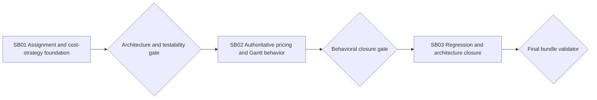

# Phase Plan

## Phase Sequence

1. `SB01`: completed — extracted assignment resolution and cost strategies, wired composition, and captured Behavioral proof.
2. `SB02`: completed — enforced lifecycle-aware authoritative price refresh and mixed-assignee preservation across create/update paths.
3. `SB03`: completed — regression/build/browser proof and the independent architecture review passed with non-blocking follow-up recorded.

## Subbundle Dependency Map

- `SB02` started only after direct seams and the old duplicate resolver paths were removed.
- `SB03` may reopen either predecessor when integration or browser proof contradicts it. Current proof has not contradicted either predecessor.

## Critical Subbundles

- `SB01` is a critical foundation, proof tier `Behavioral`. Downstream unlock requires direct tests for all strategies and the assignment resolver, negative exact-registration proof, affected build, no-new-partial proof, and architecture review.
- `SB02` is proof tier `Behavioral`. It requires realistic positive and negative lifecycle/assignment cases.
- `SB03` is proof tier `Behavioral` because it owns the user-visible open-dialog regression. It requires Standard build/test proof plus the realistic mixed-assignee browser or closest available rendered proof.

## Phase Gates

- Gate after preparation: run the bundle validator and repair failures.
- Gate before each subbundle: confirm prerequisites are complete and still valid.
- Gate after each subbundle: capture proof, review screenshots, and decide whether downstream work may continue.
- Gate before closure: rerun validators, close raw notes, and reopen anything with weak proof.

## Current Gate Position

- Preparation gate: passed with the canonical validator on 2026-07-23.
- SB01 and SB02: passed their Behavioral test/build gates.
- SB03: browser and regression gates passed. The independent C# architecture review passed with non-blocking follow-up: keep the narrow bridge bounded and add focused pricing/revision assertions before changing bulk delete/move paths.

## UI Target Policy

- CanDoItAll applications target large-screen desktop viewports. Do not add small/medium/mobile tuning unless explicitly requested.
- Reusable basic `CanDoItAll.Components.BaseLib` work validates small, medium, and large viewports.
