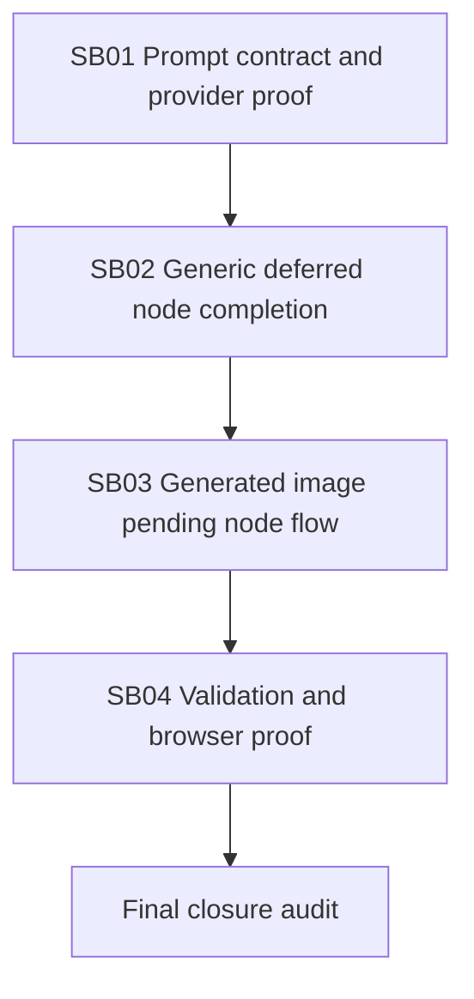

# Phase Plan

## Phase Sequence

1. Validate the current prompt/provider contract and identify the exact boundary that needs stronger proof.
2. Add the generic deferred node completion infrastructure and canonical media replacement method.
3. Convert generated image creation to immediate placeholder node plus deferred completion.
4. Rebuild, restart 5032, run targeted tests, and prove the right-click Generate image path in a browser.
5. Close raw notes one by one and run final bundle validation.

## Subbundle Dependency Map

## Critical Subbundles

- SB01 is a critical foundation because a deferred UI flow is worthless if the provider still receives the wrong prompt or options.
- SB02 is a critical foundation because it owns canonical media replacement and background execution boundaries.
- SB03 is a critical UI foundation because it changes the user-visible right-click create flow.

## Phase Gates

- Gate after preparation: run `python C:\Users\lucys\.codex\skills\candoitall-bundle-preparation\scripts\validate_bundle.py .codex\bundles\project-structure-deferred-image-creation --stage prepared`.
- Gate before SB01: source references still match current files and the existing generated-image test is understood.
- Gate after SB01: provider request proof includes prompt, provider id, model, size, quality, and format.
- Gate after SB02: media replacement updates the same node and does not bypass `ProjectWorkbenchService`.
- Gate after SB03: the component flow creates a node immediately, shows waiting media, and completes/fails the same node.
- Gate after SB04: clean build, targeted tests, restarted 5032 instance, and Playwright right-click path proof are recorded.
- Gate before closure: raw notes are marked `Solved`, `Partially solved`, or `Not solved` with proof references.
