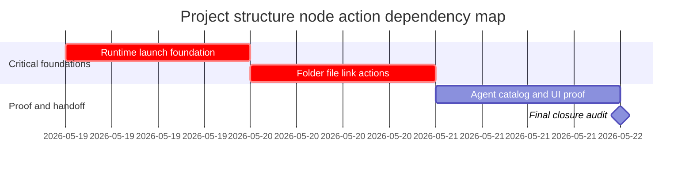

# Phase Plan

## Phase Sequence

1. Run the prepared-stage bundle validator and manual readiness gate.
2. Execute `01-01-runtime-launch-foundation`; prove launch-plan resolution and visible runtime actions before downstream work.
3. Execute `02-02-folder-file-link-actions`; prove local folder/file open capability and GitHub/GitLab recognition.
4. Execute `03-03-agent-catalog-and-ui-proof`; update agent tool guidance and capture Playwright MCP screenshots.
5. Run targeted tests, build checks as needed, completed-stage bundle validator, and raw-note closure audit.

## Subbundle Dependency Map

- `02-02-folder-file-link-actions` may start only after runtime capability wiring is trusted enough that shared action menus are stable.
- `03-03-agent-catalog-and-ui-proof` may start only after the supported node types, metadata keys, aliases, and actionCapabilities are no longer speculative.
- Final closure requires all executed subbundles to be `Completed` or explicitly `Blocked`.

## Critical Subbundles

- `01-01-runtime-launch-foundation` is a critical foundation because broken launch resolution invalidates runtime UI actions and agent actionCapabilities.
- `02-02-folder-file-link-actions` is a critical foundation because folder/file path resolution and URL recognition determine what the UI and agents can truthfully advertise.
- Both critical subbundles require targeted tests plus at least one downstream smoke through action rendering before progression.

## Phase Gates

- Prepared gate: `python codex\skills\bundles\candoitall-bundle-preparation\scripts\validate_bundle.py .codex\bundles\project-structure-node-actions --stage prepared`.
- Entry gate per subbundle: read its README, verify prerequisites, and confirm exact source references still exist.
- Closure gate per subbundle: tests/proof pass, execution report rows updated, screenshot review recorded where UI-visible.
- Final closure gate: completed-stage validator passes, raw notes are `Solved`, `Partially solved`, or `Not solved`, and Playwright MCP evidence is recorded.
