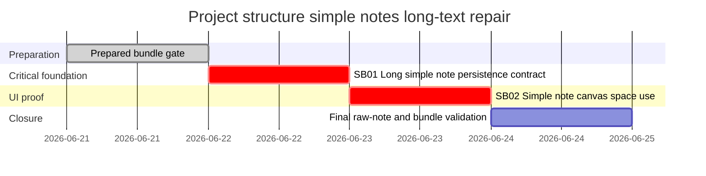

# Phase Plan

## Phase Sequence

1. Prepared-stage gate: run `python codex/skills/bundles/candoitall-bundle-preparation/scripts/validate_bundle.py --stage prepared .codex/bundles/project-structure-simple-notes-long-text-v1` and manual readiness review.
2. Execute `SB01` to fix and prove long simple-note persistence/title derivation.
3. Execute `SB02` to fix and prove inline-note card space use with browser screenshots.
4. Final closure: run targeted component/Playwright validation, audit raw notes one by one, then run completed-stage bundle validation.

## Subbundle Dependency Map

## Critical Subbundles

- `SB01` is a critical foundation because the UI proof must render text that has survived create/edit persistence, not merely a seeded runtime string.
- `SB02` is a critical UI closure subbundle because the user explicitly requires screenshot-based analysis before and after the change.

## Phase Gates

- Prepared gate: all raw notes are mapped, screenshot artifact is preserved, subbundle READMEs name exact source references, and browser proof is planned.
- `SB01` entry gate: current Workbench and CanvasLib note create/edit paths are re-read; no implementation begins if source references are stale.
- `SB01` closure gate: failing-first or pre-change evidence demonstrates the old weak contract, passing component/browser proof demonstrates full `Notes` preservation, and `proof/SB01/manifest.md` plus `proof/SB01/semantic-invariants.md` exist.
- `SB02` entry gate: `SB01` is complete and trusted; package update plan is known; screenshot baseline has been reviewed.
- `SB02` closure gate: large desktop and narrower browser screenshots are captured, DOM metrics prove dynamic note width, visual review questions are answered, and `proof/SB02/manifest.md` plus `proof/SB02/semantic-invariants.md` exist.
- Final gate: completed-stage validator passes, execution report rows are populated, and all raw notes are `Solved` or have explicit follow-up/blocker rows.
