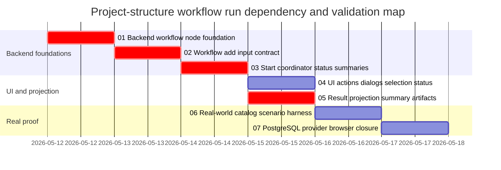

# Phase Plan

## Phase Sequence

1. Backend node identity and API/service foundation.
2. Workflow input contract and add-dialog data model.
3. Start coordinator, status projection, and summary projection.
4. Project-structure canvas UI actions, dialogs, and selection status.
5. Result-node parentage and execution-summary artifacts.
6. Real-world workflow catalog and scenario harness.
7. PostgreSQL/provider/browser validation and final closure.

## Subbundle Dependency Map

- Subbundle 04 can begin only after subbundle 03 proves backend start/status behavior.
- Subbundle 06 can begin catalog work after subbundle 05 defines the summary/result projection contract.
- Subbundle 07 cannot pass until UI proof and 20 scenario proof agree with backend state.

## Critical Subbundles

- `01-backend-project-structure-workflow-node-foundation`: critical foundation for workflow node identity, typed metadata, and API/service contracts.
- `02-workflow-add-dialog-and-input-contract`: critical foundation for the absolute project/parent input requirements.
- `03-workflow-start-coordinator-status-and-summaries`: critical foundation for start confirmation, run state, progress, markers, and selection status.
- `05-workflow-result-node-projection-and-summary-artifacts`: critical foundation for result-node parentage and file path summaries.

## Phase Gates

- Gate after preparation: run `python C:\Users\lucys\.codex\skills\candoitall-bundle-preparation\scripts\validate_bundle.py --stage prepared .codex\bundles\project-structure-workflow-runs` and complete manual readiness review.
- Gate before subbundle 01: confirm repo state and no active conflicting workflow/project-structure edits.
- Gate after subbundle 01: backend contract tests pass and no UI code depends on untyped metadata.
- Gate after subbundle 02: input preview/composition tests include project details, parent details, files/folders, and manual JSON.
- Gate after subbundle 03: start/status/progress/marker/summary mapping tests pass for running, completed, waiting, failed, and cancelled states.
- Gate after subbundle 04: Playwright large-screen and narrow-screen UI proof exists for add workflow, context menu, start confirmation, and selection status.
- Gate after subbundle 05: result nodes are created under workflow node and execution summary includes created node ids, created asset ids, and file paths.
- Gate after subbundle 06: at least 20 scenario definitions exist and the harness runs against PostgreSQL.
- Gate before closure: scenario proof, browser proof, provider proof, raw note closure, completed-stage validator, and manual validator all pass; global solution-test residuals must be explicit and unrelated to project-structure workflow behavior.
