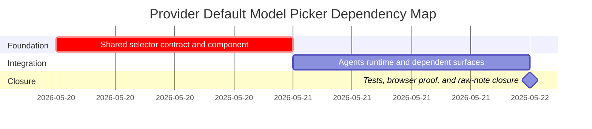

# Phase Plan

## Phase Sequence

1. Prepare and validate the shared provider model selector contract.
2. Implement the shared component and focused component tests.
3. Integrate the component into the Agents Runtime tab, normalize save semantics, and update impacted tests.
4. Review workflow and memory surfaces, adopting the component where the existing contract supports it.
5. Run targeted tests, capture browser proof or an explicit blocker, close raw input, and run final validators.

## Subbundle Dependency Map

## Critical Subbundles

- `01-shared-provider-model-choice-foundation` is critical because all later UI surfaces depend on its default, suggested-model, and override semantics.
- `02-agents-runtime-tab-and-dependent-surfaces` depends on subbundle 01 and must not ship if the selector cannot preserve provider-default linkage.

## Phase Gates

- Gate after preparation: run `validate_bundle.py --stage prepared --profile initiative` and manual readiness audit.
- Gate before subbundle 01: confirm provider model fields and BaseLib components are still present.
- Gate after subbundle 01: component tests prove default, suggested, and override behavior.
- Gate before subbundle 02: confirm subbundle 01 is complete and selector API is stable.
- Gate after subbundle 02: targeted tests and browser proof show agent Runtime tab behavior and no dependent surface regression.
- Final gate: close raw request as Solved or document concrete follow-up if a dependent surface cannot yet adopt the component.
