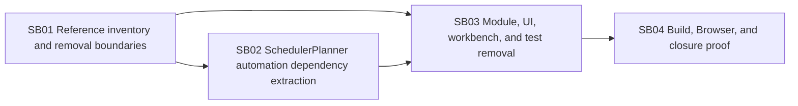

# Phase Plan

## Execution Order

1. SB01 maps references, classifies direct module dependencies, and defines keep/remove boundaries.
2. SB02 removes SchedulerPlanner's direct Automation dependency while preserving scheduler page/build behavior.
3. SB03 removes the three module projects, product connections, and obsolete tests.
4. SB04 rebuilds, restarts port `5032`, performs Browser smoke validation, and closes bundle proof.

## Subbundle Dependency Map

## Critical Subbundles

- `SB01` is critical because deletion without a reference map risks hidden menu and test connections.
- `SB02` is critical because Automation cannot be removed safely while SchedulerPlanner imports its trigger contracts.
- `SB03` is critical because it performs the product-code deletion and must prove no stale routes or project references remain.

## Phase Gates

- Gate after preparation: run `validate_bundle.py --stage prepared --profile initiative` and repair failures.
- Gate before SB02: confirm SB01 workbook exists and direct-reference categories are mapped.
- Gate before SB03: confirm SchedulerPlanner no longer has a compile-time Automation dependency.
- Gate before SB04: confirm direct old-module `rg` audit is clean outside explicit historical artifacts.
- Gate before closure: run build/test/browser proof, update execution report, then run `validate_bundle.py --stage completed --profile initiative`.
