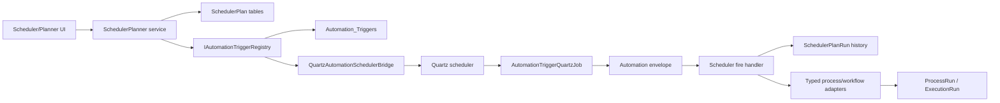

# Target Solution

## Module Boundary

Add a product-facing `CanDoItAll.Modules.SchedulerPlanner` module rather than putting workflow/process scheduling directly into `CanDoItAll.Modules.Automation`.

Reasoning:

- `Automation` is already the generic trigger, Quartz projection, durable envelope, dispatcher, and diagnostics module.
- Workflow/process launch requires dependencies on `Processes` and `AgentFramework`; pushing those into `Automation` would make infrastructure depend on product modules.
- A thin SchedulerPlanner module can depend on `Automation`, `Processes`, and `AgentFramework` without inverting the existing architecture.

Expected composition edits during implementation:

- Add module project under `C:\repositories\CanDoItAll\src\CanDoItAll.Modules.SchedulerPlanner`.
- Add a marker type and service registration extension.
- Add the module to `C:\repositories\CanDoItAll\src\CanDoItAll.Composition\CanDoItAll.Composition.csproj`.
- Add the marker assembly to `C:\repositories\CanDoItAll\src\CanDoItAll.Composition\ModuleAssemblies.cs`.
- Register services in `C:\repositories\CanDoItAll\src\CanDoItAll.Composition\RuntimeHostServiceCollectionExtensions.cs`.
- Add Web project reference and navigation route where required.

## Core Domain Model

Recommended entities:

- `SchedulerPlan`
  - `Id`
  - `DisplayName`
  - `TargetKind`: `Process` or `Workflow`
  - `TargetId`
  - `TargetDisplayName`
  - `CronExpression`
  - `CronDescription`
  - `TimeZoneId`
  - `MisfirePolicy`
  - `IsEnabled`
  - `StartAtUtc`
  - `EndAtUtc`
  - `AutomationTriggerId`
  - `CreatedAtUtc`
  - `UpdatedAtUtc`
  - `UpdatedBy`
- `SchedulerPlanRun`
  - `Id`
  - `PlanId`
  - `AutomationTriggerId`
  - `AutomationEnvelopeId`
  - `DedupeKey`
  - `ScheduledFireAtUtc`
  - `ObservedFireAtUtc`
  - `StartedAtUtc`
  - `CompletedAtUtc`
  - `TargetRunKind`
  - `TargetRunId`
  - `Status`
  - `ErrorCode`
  - `ErrorSummary`
  - `CreatedAtUtc`
  - `UpdatedAtUtc`

Use typed enums/value objects for target kind, run status, and owner/trigger key generation. Do not store target semantics only inside JSON payloads.

## Automation Projection

SchedulerPlanner owns the product schedule. Automation owns Quartz trigger projection.

## Quartz DB Recovery

Implementation must configure Quartz persistent store, not only rehydrate `Automation_Triggers`.

Minimum requirements:

- Use Quartz ADO.NET persistent store for supported database profiles.
- Use string job-data properties where possible to avoid serialized object versioning.
- Use a JSON serializer package if Quartz job data serialization is needed.
- Install/migrate Quartz tables for SQLite and PostgreSQL runtime profiles or explicitly fail unsupported profiles during startup.
- Prove that a scheduled plan survives process restart and that Quartz recovers the trigger from DB.

`Automation_Triggers` should remain the canonical product trigger projection unless implementation uncovers a stronger existing pattern. Quartz tables are scheduler recovery infrastructure, not the user-facing schedule source of truth.

## CRON Description

Add an adapter service such as `ICronDescriptionService`:

- Validates with Quartz `CronExpression.IsValidExpression`.
- Produces a description from the CRON expression and time zone.
- Throws/returns explicit validation errors for unsupported expressions; it must not silently fall back to showing the raw CRON as if it were valid.
- Wraps the selected package, likely `CronExpressionDescriptor`, behind an internal service so the package can be replaced if Quartz-specific expression support is insufficient.

## Fire Handling

Add an Automation message handler in SchedulerPlanner for `AutomationTriggerFireRequest` where the trigger owner/key belongs to SchedulerPlanner.

Required behavior:

- Resolve `SchedulerPlan` by trigger id/key.
- Create or update `SchedulerPlanRun` with deterministic dedupe key.
- Launch target through typed adapters.
- Store target run id and status.
- Mark failures explicitly and let Automation delivery retry/dead-letter behavior remain visible.
- Log schedule id, plan id, target kind, target id, fire id, envelope id, dedupe key, and masked error summary.

## UI Direction

Use the generated proposal image in `evidence/ui-layout-proposals.png` as visual input. Preferred product direction:

- Use Proposal A as the primary layout: table-first operations console.
- Borrow Proposal B's timeline/detail drawer for next/last fire inspection.
- Use Proposal C's guided setup only inside the `New schedule` tab, not as a full-page wizard.
- Use CanvasLib `CanvasCalendar` as the calendar preview surface for scheduled runs. The calendar should visualize projected next fire windows and recent actual scheduled fires as read-only `CanvasCalendarEvent` blocks.

Own page:

- Route recommendation: `/scheduler` if treated as a first-class module; also link from Automation navigation context if the shell supports it.
- Required tabs: `Scheduled runs`, `New schedule`, `Run history`.
- Use existing BaseLib wrappers: `PageScaffold`, `PageHeader`, `Tabs`, `SummaryTile`, `FilterBar`, form fields, buttons, status badges, empty states, and data grid/table wrappers where available.
- Use `CanvasCalendar` in `Scheduled runs` for the calendar/timeline view and in `New schedule` as an optional next-fire preview if the form has a valid CRON. Do not use CanvasCalendar as the editor for schedule creation because it models concrete event windows, not recurring CRON definitions.

## CanvasLib Calendar Fit

`CanvasCalendar` is a good fit for scheduler visualization because `CanvasCalendarSurface` already supports:

- concrete events with `StartUtc` and `EndUtc`
- title, description, status, type, color, and read-only flags
- selected date/event state
- timezone and timezone options
- week/day views, slot minutes, business hours, and mini-month navigation
- selection/state callbacks for linking a calendar event back to a schedule/run detail panel

It is not the source of recurrence truth. SchedulerPlanner should compute projected occurrences from Quartz/CRON schedule metadata and map them into read-only `CanvasCalendarEvent` values.

## Validation Strategy

- Integration tests for domain persistence, Automation trigger projection, Quartz DB restart/recovery, fire handler dedupe, process adapter, workflow adapter, and history queries.
- Component tests for tab rendering, validation states, history filters, and schedule command outcomes.
- Playwright proof for page route, tab switching, schedule form validation, active schedule table, CanvasCalendar nonblank rendering, history search, wide viewport screenshot, and narrower viewport screenshot.
