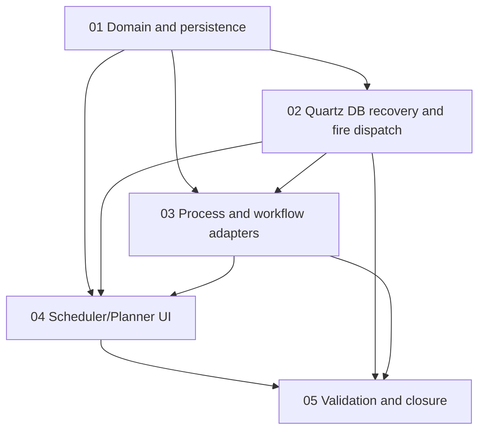

# Phase Plan

## Execution Order

1. `01-scheduler-domain-and-persistence`
2. `02-quartz-db-recovery-and-fire-dispatch`
3. `03-process-and-workflow-run-adapters`
4. `04-scheduler-planner-ui`
5. `05-validation-and-closure`

## Subbundle Dependency Map

## Critical Subbundles

- `01-scheduler-domain-and-persistence`: establishes typed schedule contracts, persistence, CRON description, and query shape used by every later subbundle.
- `02-quartz-db-recovery-and-fire-dispatch`: closes the architect's explicit DB recovery requirement and proves Quartz is not relying on volatile RAM scheduling.
- `03-process-and-workflow-run-adapters`: proves scheduled fires actually start typed target runs and write run correlation.
- `04-scheduler-planner-ui`: exposes the required operator workflow and must prove the tabbed page is usable.

## Phase Gates

- Gate 1: Domain model, EF mapping, schedule validation, and CRON description service are proven before any Quartz fire handling or UI save flow depends on them.
- Gate 2: Quartz persistent store/recovery is proven before this feature can be considered architecturally compliant.
- Gate 3: Process and workflow launch adapters are proven with typed correlation before the UI can expose schedule creation as complete.
- Gate 4: Browser proof must verify all three tabs and dense responsive layout before closure.

## Recommended Agent Split

- Domain/persistence worker: owns SchedulerPlanner project, entities, service contracts, EF configurations, and CRON description adapter.
- Automation/Quartz worker: owns Quartz persistent-store configuration, Automation trigger projection adjustments, fire handler, and restart/recovery tests.
- Adapter worker: owns process/workflow launch adapters and correlation behavior.
- UI worker: owns page/components and component/browser tests after foundations pass.
- Validation worker: owns final test sweep, evidence review, execution report, and residual risks.

## Validation Commands To Plan For Implementation

- `dotnet build C:\repositories\CanDoItAll\CanDoItAll.slnx`
- `dotnet test C:\repositories\CanDoItAll\tests\CanDoItAll.Tests.Integration\CanDoItAll.Tests.Integration.csproj`
- `dotnet test C:\repositories\CanDoItAll\tests\CanDoItAll.Tests.Components\CanDoItAll.Tests.Components.csproj`
- `dotnet test C:\repositories\CanDoItAll\tests\CanDoItAll.Tests.Playwright\CanDoItAll.Tests.Playwright.csproj`
- Browser run against the Scheduler/Planner route with screenshots saved into the execution report evidence folder.
