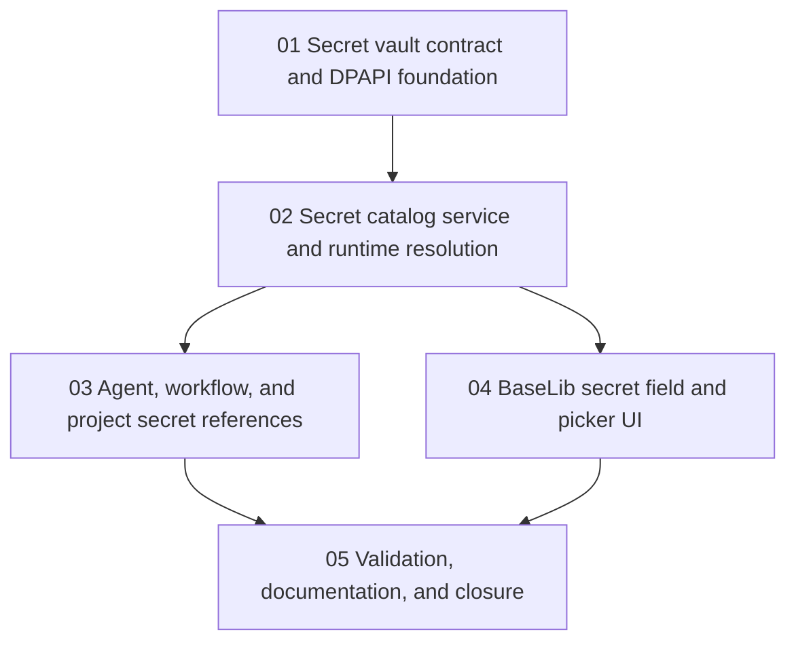

# Phase Plan

## Subbundle Dependency Map

## Critical Subbundles

- `SB01` is a critical foundation because later storage and runtime code depends on provider behavior, unsupported-provider failures, and DPAPI semantics.
- `SB02` is a critical foundation because all UI references and workflow/agent runtime use the catalog/runtime resolver.
- `SB03` is a critical foundation for workflows and agents because it controls which action can resolve which secret.

## Execution Order

1. `SB01` Secret vault contract and DPAPI foundation.
2. `SB02` Secret catalog service and runtime resolution.
3. `SB03` Agent, workflow, and project secret reference surfaces.
4. `SB04` BaseLib secret field and picker UI.
5. `SB05` Validation, documentation, and closure.

## Phase Gates

- `SB01`: DPAPI and factory tests pass on Windows; unsupported stubs throw explicit provider errors; no caller writes raw values around the vault.
- `SB02`: Existing secret CRUD and storage/provider credential resolution use the vault and do not promote vault-backed values into process-wide environment state.
- `SB03`: Agent settings, workflow HTTP settings, and project-structure metadata store references only; runtime resolution is blocked without explicit permission.
- `SB04`: BaseLib secret field hides after 30 seconds, copy controls work, and dialogs render without clipping in browser proof.
- `SB05`: Targeted tests, build, docs, browser analytics, and raw note closure are complete.
