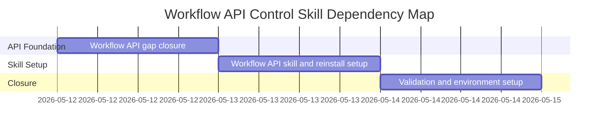

# Phase Plan

## Phase Sequence

1. Prepare and validate this focused bundle.
2. Execute subbundle 01: add missing workflow API lifecycle/import/export commands and tests.
3. Execute subbundle 02: add workflow API skill and confirm the reinstall script discovers it.
4. Execute subbundle 03: run targeted validation, run reinstall/setup, verify local skill presence, and close raw notes.

## Subbundle Dependency Map

- Subbundle 02 depends on the final workflow route list from subbundle 01.
- Subbundle 03 depends on the skill folder from subbundle 02 and API tests from subbundle 01.

## Critical Subbundles

- Subbundle 01 is a critical foundation because the workflow skill must document the actual shipped API surface.
- Subbundle 02 is a critical foundation for local setup because reinstall proof is meaningless unless the skill exists under `codex\skills`.

## Phase Gates

- Preparation gate: run `python codex\skills\bundles\candoitall-bundle-preparation\scripts\validate_bundle.py .codex\bundles\workflow-api-control-skill --profile initiative --stage prepared`.
- Subbundle 01 entry gate: confirm current workflow API lacks explicit lifecycle and import/export commands.
- Subbundle 01 closure gate: targeted workflow API tests prove lifecycle and import/export commands.
- Subbundle 02 entry gate: confirm existing API skill structure and OpenAI skill docs requirements.
- Subbundle 02 closure gate: new skill exists and script discovery remains generic.
- Subbundle 03 closure gate: targeted validation, reinstall/local skill proof, final bundle validator, and raw-note closure all agree.
