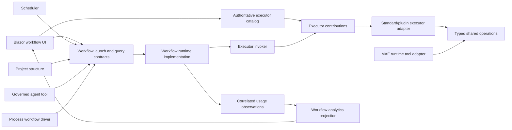

# Target Solution

## Shape

## Boundaries

- `Workflows.Abstractions` owns active catalog/runtime/launch/query contracts and behavior-free request/result types.
- `Workflows.Core` owns application orchestration and depends on Abstractions, Models, and executor abstractions—not Runtime.
- `Workflows.Runtime` implements lifecycle coordination. Persistence implementations can remain in the current module initially but implement inward contracts and are isolated for later extraction.
- `WorkflowExecutors.Abstractions` owns executor, descriptor, contribution, and telemetry contracts.
- Standard/plugin projects contain thin adapters. Shared file/document/spreadsheet/image operations live in existing Core/tool service boundaries or a narrowly extracted SDK-free contract project.
- UI modules depend on contracts/catalogs. Renderer components are registered explicitly by trusted composition modules.

## Decisions

- Keep the executor invoker policy pipeline; repair its composition seam instead of replacing it.
- Use one immutable contribution as descriptor truth for catalog and invocation. Planned entries may be descriptor-only and non-runnable.
- Do not create a generic “invoke any agent tool” node. Tool transports have different authorization, receipt, and conversational semantics.
- Extend document conversion with a content-returning typed result so source ingestion and artifact conversion share ManagedCode.MarkItDown without duplicate parsers.
- Persist accepted/running before backend invocation, append progress, and persist terminal state in a final transition. Do not mislabel in-process execution as durable.
- Persist canonical usage observations rather than parsing event JSON for production analytics. Event payload summaries remain diagnostic/compatibility data.
- Use registered, allow-listed settings renderer keys. Schema rendering is the safe plugin default; manifest type-name strings never directly activate Blazor components.

## Failure Semantics

- Duplicate executor IDs, dangling renderer keys, unsupported schema versions, unsafe command recipes, invalid workflow inputs, unavailable backends, and unavailable providers fail explicitly.
- Logs include workflow/run/node/executor/plugin/origin identifiers and mask secrets and content.
- Requested backend fallback is explicit and user-visible. Renderer fallback occurs only when the descriptor explicitly selects schema mode.
