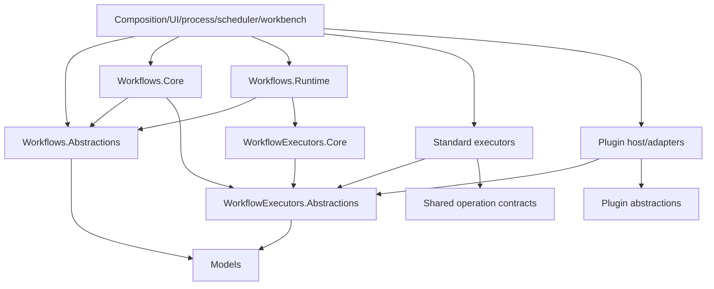

# C# Dependency Direction

## Required Direction

## Forbidden Edges

- Workflows.Core → Workflows.Runtime.
- Workflows.Abstractions → Common Core, Runtime, persistence, modules, or Blazor.
- Workflow executor abstractions/core → standard/plugin implementations.
- Shared operations → workflow executors or runtime tools.
- Plugin SDK/abstractions → Modules.Plugins.
- Runtime/analytics → Blazor pages.
- Untrusted plugin package → application component `Type` activation.

## Migration Sequence

1. Make Workflows.Abstractions contracts feature-complete and update consumers.
2. Remove duplicate interfaces and the Core-to-Runtime reference.
3. Add dependency tests before executor contribution changes.
4. Introduce one executor contribution contract and migrate standard registrations.
5. Adapt plugin manifests/implementations through the same contract and remove dead/outward paths.
6. Add shared operation contracts without making Core depend on tool/runtime adapter projects.
7. Add launch and analytics contracts before persistence/UI consumers.

## Verification

- Project-reference assertions in `WorkflowFoundationHardeningCheckpointTests` and plugin boundary tests.
- CodeAnalytics dependency/cycle snapshot before closure.
- `dotnet build CanDoItAll.slnx` after each boundary slice.
