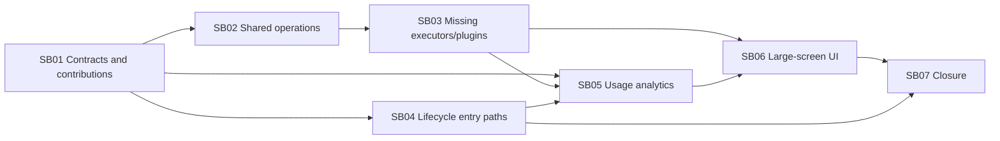

# Phase Plan

## Execution Order

1. Repair workflow contracts/dependencies and unify executor contributions.
2. Extract shared operations and refactor source ingestion around ManagedCode.MarkItDown.
3. Add missing standard/plugin nodes and close descriptor/implementation drift.
4. Make launch paths and runtime lifecycle consistent, including process and generic agent adapters.
5. Persist canonical usage observations and expose typed workflow analytics.
6. Extract catalog-driven settings UI and trusted plugin renderer strategies; add analytics presentation.
7. Run integration, dependency, architecture, and maximized browser closure.

## Subbundle Dependency Map

## Critical Subbundles

- SB01 is a critical foundation: later work must not build on duplicate contracts or dual descriptor truth.
- SB02 is a critical semantic refactor: document conversion parity must pass before adding the Markdown executor.
- SB04 is process/lifecycle critical: a registered but unused bridge is not proof; Running persistence and each launch origin must execute.
- SB05 is data critical: canonical usage producer-to-consumer proof is required before UI totals.
- SB06 is UI critical: component tests plus maximized browser proof are required. Small/medium validation is intentionally excluded by the user.

## Phase Gates

- Preparation gate: `validate_bundle.py --profile initiative --stage prepared` succeeds and manual readiness review is recorded.
- Entry gate: prerequisite subbundles are completed, their proof manifests exist, and affected baseline assumptions still hold.
- Progression gate: focused build/tests plus named semantic and negative proof pass; update the execution report before continuing.
- UI gate: retry components MCP, then prove BaseLib/CanvasLib reuse, settings round trips, and maximized `/agents/workflows` behavior.
- Closure gate: run completed-bundle validator, architecture review gate, CodeAnalytics dependency/cycle comparison, solution build, focused/integration tests, and browser screenshot review.
