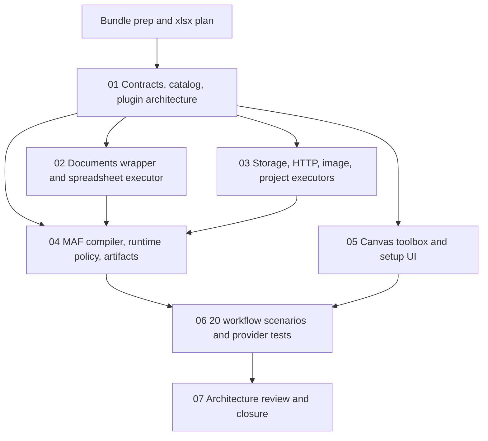

# Phase Plan

## Phase Sequence

1. Prepare and validate the bundle. Produce the xlsx plan before implementation starts so scope, dependencies, and examples are trackable.
2. Implement executor contracts, descriptor catalog, validator support, and plugin-ready setup metadata.
3. Implement `CanDoItAll.Tools.Documents` and spreadsheet service/executor because later scenarios depend on real workbook proof.
4. Implement storage, HTTP, project-structure, and image executor entries through existing services, using explicit unavailable-service failures where host registration is not ready.
5. Wire MAF compiler/runtime invocation, shared timeout/retry behavior, artifact/event capture, and failure telemetry.
6. Wire workflow canvas grouped right-click actions, component toolbox entries, and descriptor-backed setup UI.
7. Run scenario validation, provider attempts, browser proof, and architecture review. Close raw notes only after proof is in `reviews/01-execution-report.md`.

## Subbundle Dependency Map

## Critical Subbundles

- `01` is a critical architecture foundation. Downstream work may not proceed if executor ids, descriptors, settings schema, and setup renderer keys are not stable and typed.
- `02` is a critical wrapper foundation. Spreadsheet scenarios may not proceed if ClosedXML leaks outside `CanDoItAll.Tools.Documents`.
- `04` is a critical runtime foundation. Scenario testing may not proceed if MAF still passes executor nodes through without invocation.
- `05` is a critical UI foundation. Browser proof must show discoverability through both right-click and toolbox paths before closure.

## Phase Gates

- Gate after preparation: run the bundle validator and repair failures.
- Gate before each subbundle: confirm prerequisites are complete and still valid.
- Gate after each subbundle: capture proof, review screenshots when UI-visible, and decide whether downstream work may continue.
- Gate before closure: rerun validators, close raw notes, and reopen anything with weak proof.
