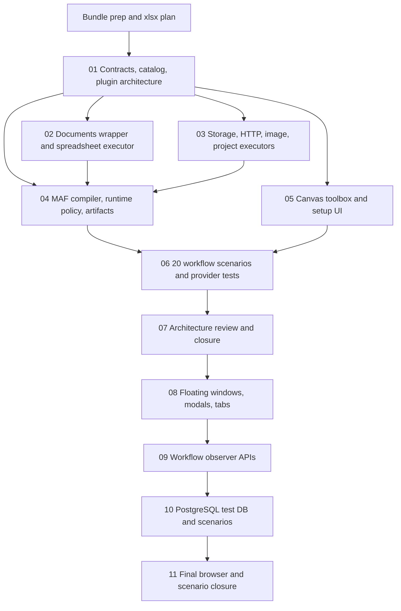

# Phase Plan

## Phase Sequence

1. Prepare and validate the bundle. Produce the xlsx plan before implementation starts so scope, dependencies, and examples are trackable.
2. Implement executor contracts, descriptor catalog, validator support, and plugin-ready setup metadata.
3. Implement `CanDoItAll.Tools.Documents` and spreadsheet service/executor because later scenarios depend on real workbook proof.
4. Implement storage, HTTP, project-structure, and image executor entries through existing services, using explicit unavailable-service failures where host registration is not ready.
5. Wire MAF compiler/runtime invocation, shared timeout/retry behavior, artifact/event capture, and failure telemetry.
6. Wire workflow canvas grouped right-click actions, component toolbox entries, and descriptor-backed setup UI.
7. Run scenario validation, provider attempts, browser proof, and architecture review. Close raw notes only after proof is in `reviews/01-execution-report.md`.
8. Reopen the canvas UI subbundle for the stricter follow-up: workflow toolbox and selection become floating canvas windows, creation becomes modal, node double-click opens an edit/details modal, and the workflows page is split into operational tabs.
9. Add observer-grade workflow APIs that mirror the process API control pattern closely enough for automated/human-observer tests.
10. Create a dedicated PostgreSQL test database, run the app against it, seed projects/project structures and 20 real-world workflow examples, and repair defects found by those examples.
11. Close the reopened bundle with browser, API, database, scenario, and raw-note proof.

## Subbundle Dependency Map

## Critical Subbundles

- `01` is a critical architecture foundation. Downstream work may not proceed if executor ids, descriptors, settings schema, and setup renderer keys are not stable and typed.
- `02` is a critical wrapper foundation. Spreadsheet scenarios may not proceed if ClosedXML leaks outside `CanDoItAll.Tools.Documents`.
- `04` is a critical runtime foundation. Scenario testing may not proceed if MAF still passes executor nodes through without invocation.
- `05` is a critical UI foundation. Browser proof must show discoverability through both right-click and toolbox paths before closure.
- `08` is a reopened critical UI foundation. PostgreSQL scenario proof may not proceed until the canvas add/edit flows are browser-verified with floating windows and modals.
- `09` is a critical observer API foundation. Scenario tests may not rely only on UI clicks if workflow APIs cannot start, inspect, cancel, and respond to runs.
- `10` is a critical end-to-end proof foundation. Final closure cannot pass without honest PostgreSQL/test-instance and scenario evidence.

## Phase Gates

- Gate after preparation: run the bundle validator and repair failures.
- Gate before each subbundle: confirm prerequisites are complete and still valid.
- Gate after each subbundle: capture proof, review screenshots when UI-visible, and decide whether downstream work may continue.
- Gate before closure: rerun validators, close raw notes, and reopen anything with weak proof.
- Reopened gate: rerun prepared-stage validation after adding subbundles 08-11 before touching implementation code.
- UI gate: subbundle 08 needs Playwright proof with open floating windows and modals at desktop and narrower widths.
- Database gate: subbundle 10 must distinguish durable PostgreSQL seed data from running-instance in-memory workflow seed data.
