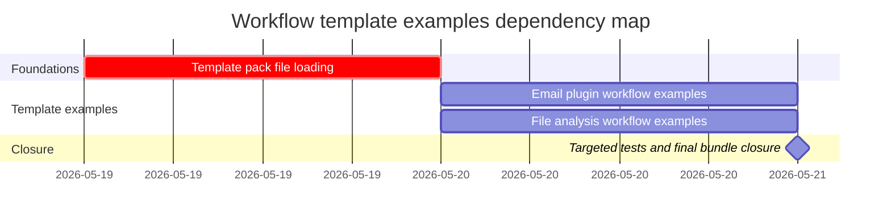

# Phase Plan

## Phase Sequence

1. Prepare and validate the template-pack foundation: manifest references, seed version, existing key preservation, and loader coverage.
2. Add plugin-backed email task examples for Gmail and Office365, preserving existing summary examples.
3. Add file-analysis examples for Mermaid graph generation and source-code summary, then run targeted tests and final closure validation.

## Subbundle Dependency Map

- Subbundle 02 and 03 both depend on subbundle 01 because neither new template file can be trusted until the manifest/load path is proven.

## Critical Subbundles

- `01-template-pack-file-loading-foundation` is a critical foundation. Its closure requires manifest load proof and existing-key preservation.
- `02-email-plugin-workflow-examples` is process-critical for the email requirements. Its closure requires plugin executor IDs, JSON paths, and project-structure task branches to validate through graph construction and targeted assertions.

## Phase Gates

- Gate after preparation: run `validate_bundle.py --stage prepared` and repair failures.
- Gate before subbundle 01: confirm existing template pack files and loader exist.
- Gate after subbundle 01: new files are manifest-listed and loader tests can observe template keys.
- Gate before subbundle 02: subbundle 01 is complete or the manifest/load path was otherwise proven.
- Gate after subbundle 02: Gmail and Office365 task examples compile and have safe no-task branches.
- Gate before subbundle 03: subbundle 01 is complete and source ingestion settings are confirmed.
- Gate before closure: run targeted tests, update execution report, close raw notes, and run `validate_bundle.py --stage completed`.
