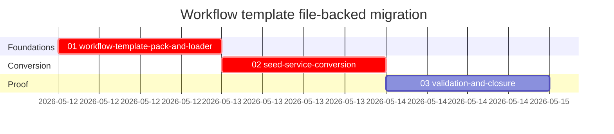

# Phase Plan

## Phase Sequence

1. Prepare the YAML template pack and typed loader.
2. Convert `WorkflowExampleCatalogSeedService` to consume the loader and remove compiled default graph construction.
3. Add regression tests, run targeted validation, update execution proof, and close the bundle.

## Subbundle Dependency Map

- Subbundle 02 cannot safely start until subbundle 01 proves every default template can become a valid `WorkflowGraph`.
- Subbundle 03 cannot close until subbundle 02 proves seeding behavior no longer depends on compiled default graphs.

## Critical Subbundles

- `01-workflow-template-pack-and-loader` is a critical foundation because every later seed/test proof depends on the loader mapping YAML into the existing workflow model correctly.
- `02-seed-service-conversion` is a critical foundation because it removes the compiled default catalog and preserves managed refresh semantics.

## Phase Gates

- Prepared gate: run `validate_bundle.py --stage prepared --profile initiative` and repair any structural issues.
- Subbundle 01 entry: confirm current compiled examples, process-loader precedent, and MAF YAML reference are understood.
- Subbundle 01 closure: every YAML template loads and validates through the workflow validator.
- Subbundle 02 entry: subbundle 01 closure passed; no unresolved template-loader blockers.
- Subbundle 02 closure: seed service no longer contains compiled default example graph builders and targeted seed tests pass.
- Subbundle 03 closure: targeted build/tests pass, bundle completed validator passes, and raw request closure is marked solved or explicitly partial.
