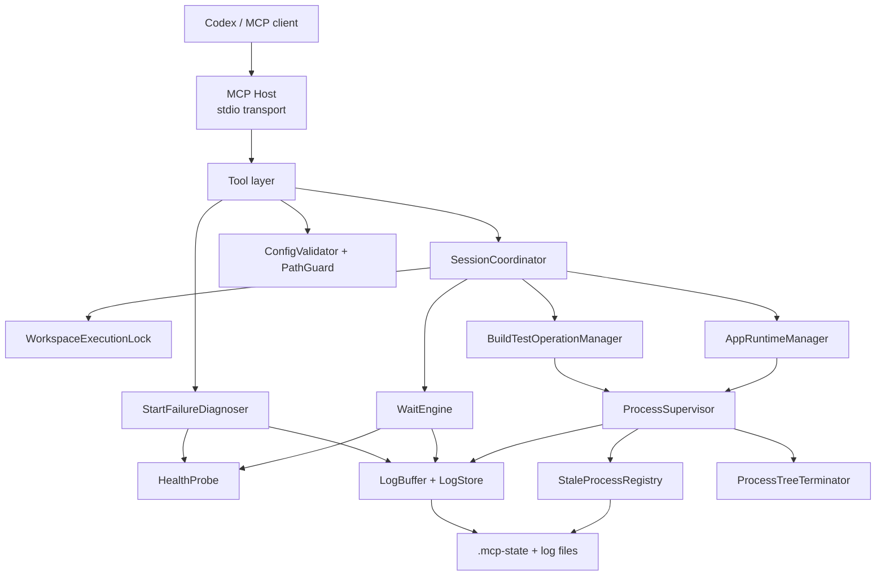

# Architektura

## 1. Přehled

Cílová architektura je **single-workspace orchestration server** pro solution CanDoItAll.  
Není to jen wrapper nad `Process.Start()`. Je to koordinátor běhu s vlastními stavy, locky, logy a recovery.

## 2. Vysoká úroveň



## 3. Hlavní vrstvy

### 3.1 MCP host vrstva
Odpovídá za:
- stdio transport,
- registraci toolů,
- dependency injection,
- bootstrap konfigurace,
- logování do stderr/file.

Záměr:
- **minimální** logika v `Program.cs`,
- žádné business rozhodování v host vrstvě,
- žádné zápisy na stdout mimo MCP protokol.

### 3.2 Tool layer
Tool layer je veřejné API serveru pro Codex.  
Každý tool:
- validuje input DTO,
- mapuje request na vnitřní službu,
- vrací strojově čitelnou response,
- nepřeskakuje koordinátor.

Tool layer nesmí:
- přímo startovat procesy,
- obcházet lock manager,
- psát na stdout.

### 3.3 Coordination layer
`SessionCoordinator` je centrální orchestrátor.  
Řeší:
- serializaci mutujících operací,
- konflikt mezi app během a build/test,
- reuse kompatibilní session,
- resume po build/test,
- mapování tool requestů na runtime a operation management.

### 3.4 Runtime management
`AppRuntimeManager` řeší:
- `WatchRun`
- `RunOnce`
- session state
- start/stop/restart transitions
- observed URLs
- health handoff
- napojení na log buffer

### 3.5 Operation management
`BuildTestOperationManager` řeší:
- build operation lifecycle
- test operation lifecycle
- operation IDs
- vlastní logy
- runner detection
- waiting/polling API
- resume policy po dokončení

### 3.6 Process supervision
`ProcessSupervisor` a `ManagedProcess` zajišťují:
- start child procesu
- capture stdout/stderr
- exit detection
- graceful stop
- force kill
- kill tree přes platform abstraction
- registraci procesu do stale registry

### 3.7 Wait engine
`WaitEngine` poskytuje server-side čekání nad:
- procesním stavem
- health probe výsledkem
- log cursory
- regex match nad logem
- quiet period

Důležité: wait engine je **server-side koordinovaný polling/event loop**, nikoli klientský `sleep`.

### 3.8 Diagnostics
`StartFailureDiagnoser` vyhodnocuje:
- start selhání aplikace
- health timeout
- chybějící SDK
- port conflicts
- early exit
- build failure

Diagnostics jsou read-only a operují nad:
- posledním session snapshotem
- posledními log entries
- health výsledky

### 3.9 State persistence
MVP používá omezenou perzistenci:
- stale process registry
- file-based log store
- volitelně session snapshots

Tato perzistence není určena pro plný restart-and-reattach model.  
Je určena pro:
- recovery,
- troubleshooting,
- cleanup.

## 4. Navržené projekty a hlavní namespace

```text
src/
  CanDoItAll.Mcp.DotNetWatch/
    Hosting/
    Configuration/
    Tools/
    Contracts/
    Runtime/
    Operations/
    Diagnostics/
    Logging/
    Security/
    Persistence/
    Utils/

tests/
  CanDoItAll.Mcp.DotNetWatch.Tests/
  CanDoItAll.Mcp.DotNetWatch.IntegrationTests/
```

Navržené hlavní namespace:

- `CanDoItAll.Mcp.DotNetWatch.Hosting`
- `CanDoItAll.Mcp.DotNetWatch.Configuration`
- `CanDoItAll.Mcp.DotNetWatch.Tools`
- `CanDoItAll.Mcp.DotNetWatch.Contracts`
- `CanDoItAll.Mcp.DotNetWatch.Runtime`
- `CanDoItAll.Mcp.DotNetWatch.Operations`
- `CanDoItAll.Mcp.DotNetWatch.Diagnostics`
- `CanDoItAll.Mcp.DotNetWatch.Logging`
- `CanDoItAll.Mcp.DotNetWatch.Security`
- `CanDoItAll.Mcp.DotNetWatch.Persistence`

## 5. Hlavní doménové objekty

### 5.1 WorkspaceDefinition
Reprezentuje:
- workspace root
- solution path
- default app project
- test project list
- povolené rooty
- default timeouts a policies

### 5.2 AppSession
Logická reprezentace běhu aplikace.

Navržená pole:
- `SessionId`
- `Mode`
- `ProjectPath`
- `WorkingDirectory`
- `Framework`
- `Configuration`
- `LaunchProfile`
- `Arguments`
- `EnvironmentOverlay`
- `State`
- `ProcessInfo`
- `ObservedUrls`
- `SessionVersion`
- `LastExitCode`
- `LastStartUtc`
- `LastRestartUtc`
- `LastStopUtc`
- `LastHealthSnapshot`
- `LastCursor`

### 5.3 OperationRecord
Reprezentuje build/test operaci.

Navržená pole:
- `OperationId`
- `OperationType`
- `State`
- `CorrelationId`
- `StartedUtc`
- `FinishedUtc`
- `RequestedByTool`
- `TargetPath`
- `Framework`
- `Configuration`
- `WhenAppRunningPolicy`
- `AffectedSessionId`
- `ResumeAttempted`
- `ResumeOutcome`
- `ExitCode`
- `Summary`
- `LastCursor`

### 5.4 ManagedProcessRecord
Reprezentuje fyzický proces nebo procesní strom.

Pole:
- `Pid`
- `StartedUtc`
- `Command`
- `Arguments`
- `WorkingDirectory`
- `WorkspaceRoot`
- `OwnerKind` (`AppSession`, `Operation`)
- `OwnerId`
- `ProcessGroupId` nebo `JobObjectName`
- `RegisteredByServerInstanceId`

## 6. Klíčové služby a odpovědnosti

### 6.1 `IWorkspaceExecutionLock`
Úkol:
- serializovat mutující operace na workspace.

Potřebné metody:
- `AcquireMutationAsync(reason, cancellationToken)`
- `TryAcquireReadSnapshot()`
- `GetCurrentHolder()`

Poznámka:
- `status`, `logs` a diagnostika lock pro mutace nepotřebují.
- `start`, `stop`, `build`, `test`, `cleanup` ano.

### 6.2 `ISessionCoordinator`
Úkol:
- centrálně řídit app a operation flow.

Klíčové metody:
- `StartAppAsync(...)`
- `StopAppAsync(...)`
- `GetAppStatusAsync(...)`
- `WaitForAppAsync(...)`
- `StartBuildAsync(...)`
- `StartTestsAsync(...)`
- `GetOperationStatusAsync(...)`
- `WaitForOperationAsync(...)`

### 6.3 `IProcessSupervisor`
Úkol:
- bezpečný lifecycle child procesů.

Musí řešit:
- async čtení stdout/stderr
- exit callbacks
- cancellation
- kill tree
- registraci do stale registry

### 6.4 `ILogBuffer`
Úkol:
- držet posledních N log entries v paměti
- generovat monotónní cursory
- umožnit read-after-cursor
- ukládat do souboru

### 6.5 `IWaitEngine`
Úkol:
- umět čekat nad více typy signálů bez klientského sleepu.

Vstupy:
- session/operation ID
- condition
- timeout
- poll interval
- optional cursor
- optional regex

Výstupy:
- `Satisfied`
- `TimedOut`
- `Aborted`
- `Failed`

### 6.6 `IHealthProbe`
Úkol:
- opakovaně testovat health URL
- vracet structured snapshot
- volitelně akceptovat localhost self-signed HTTPS

### 6.7 `IStartFailureDiagnoser`
Úkol:
- z posledních logů a statusu udělat čitelnou diagnózu.

## 7. Stavový model

### 7.1 App session states

- `Idle`
- `Starting`
- `Running`
- `Healthy`
- `Restarting`
- `Stopping`
- `Stopped`
- `Failed`
- `ExitedUnexpectedly`

`Healthy` je specializovaný stav nad `Running`, ale v návrhu ho držíme explicitně, protože je důležitý pro klienta.

### 7.2 Operation states

- `Queued`
- `Running`
- `Completed`
- `Failed`
- `TimedOut`
- `Cancelled`

## 8. Procesní strategie

### 8.1 App start – WatchRun
Navržený příkaz:

```text
dotnet watch --non-interactive --project <projectPath> run -- [app args...]
```

Výchozí environment overlay:

- `DOTNET_CLI_UI_LANGUAGE=en`
- `DOTNET_NOLOGO=1`
- `DOTNET_SKIP_FIRST_TIME_EXPERIENCE=1`
- `DOTNET_WATCH_RESTART_ON_RUDE_EDIT=1`
- `DOTNET_WATCH_SUPPRESS_LAUNCH_BROWSER=1`
- `DOTNET_WATCH_SUPPRESS_EMOJIS=1`

Doporučeně navíc:
- `DOTNET_WATCH_SUPPRESS_BROWSER_REFRESH=1`  
  Pro deterministickou browser automatizaci je lepší řídit refresh explicitně klientem.

### 8.2 App start – RunOnce
Navržený příkaz:

```text
dotnet run --project <projectPath> -- [app args...]
```

Použití:
- fallback režim,
- scénáře, kde nechceš watch,
- některé diagnostické nebo produkčnější lokální běhy.

### 8.3 Build
Navržený příkaz:

```text
dotnet build <solutionOrProjectPath> [args...]
```

Default target:
- solution path z konfigurace

### 8.4 Tests
Navržený příkaz:

```text
dotnet test <projectOrSolutionPath> [args...]
```

V MVP:
- žádné `dotnet watch test`

## 9. Policy pro konflikt s běžící app session

### `StopAndResume`
Výchozí a doporučené.
Hodí se pro:
- build
- tests
- scénáře s nejistotou locků

### `StopOnly`
Zastaví app, provede operaci, ale neobnoví ji.
Hodí se pro:
- změny, po kterých chce agent stejně jiný režim běhu

### `Fail`
Konzervativní režim.
Pokud app běží, build/test se nespustí.

### `ContinueIfSafe`
Pouze pokud jsou splněné interní heuristiky bezpečnosti.
V MVP doporučuji implementovat konzervativně:
- buď vrátit explicitní Unsupported,
- nebo povolit jen v pečlivě definovaných případech.

## 10. Logická identita a kompatibilita session

App session je kompatibilní, pokud se shodují alespoň tyto klíče:

- project path
- mode
- framework
- configuration
- launch profile
- app args
- relevantní env overlay
- optional explicit URLs override

Změna kteréhokoli z těchto parametrů je:
- konflikt,
- nebo důvod k replacement startu podle policy.

## 11. Observability

Každý běh musí mít:
- `SessionId` nebo `OperationId`
- `CorrelationId`
- log cursor
- timestamps v UTC
- source classification (`Host`, `ProcessStdOut`, `ProcessStdErr`, `HealthProbe`, `System`)

File logger by měl ukládat NDJSON nebo line-delimited JSON, aby šel dobře parsovat.

## 12. Bezpečnostní omezení

- žádné raw shell texty
- všechny cesty pod workspace root nebo whitelistem
- health probe defaultně jen na loopback hosty
- redakce známých secret patternů
- zákaz vypisovat procesní výstup na stdout MCP hostu

## 13. Doporučená interní implementační mapa tříd

Viz také `15-examples/proposed-class-map.md`.

Minimální třídy a rozhraní:

- `Program`
- `McpServerRegistration`
- `McpServerOptionsValidator`
- `WorkspaceCatalog`
- `SessionCoordinator`
- `AppRuntimeManager`
- `BuildOperationRunner`
- `TestOperationRunner`
- `OperationRegistry`
- `WorkspaceExecutionLock`
- `ManagedProcess`
- `ProcessSupervisor`
- `WindowsProcessTreeTerminator`
- `UnixProcessTreeTerminator`
- `LogEntry`
- `RingLogBuffer`
- `FileLogStore`
- `WaitEngine`
- `HttpHealthProbe`
- `StartFailureDiagnoser`
- `StaleProcessRegistry`
- `PathGuard`
- `LogRedactor`

## 14. Architektonické zásady pro code review

Přijmout až tehdy, když:
- tools neobcházejí koordinátor,
- stav není rozesetý po náhodných singletons,
- wait logika neleží v klientovi,
- build/test nevolají přímý CLI bez policy layer,
- stop opravdu killuje celý strom,
- stdout je čisté,
- logy jsou čitelné, ale bezpečné.
