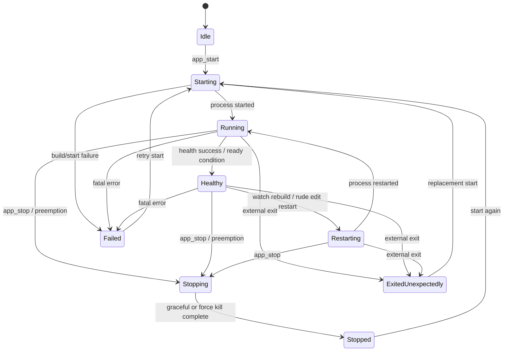
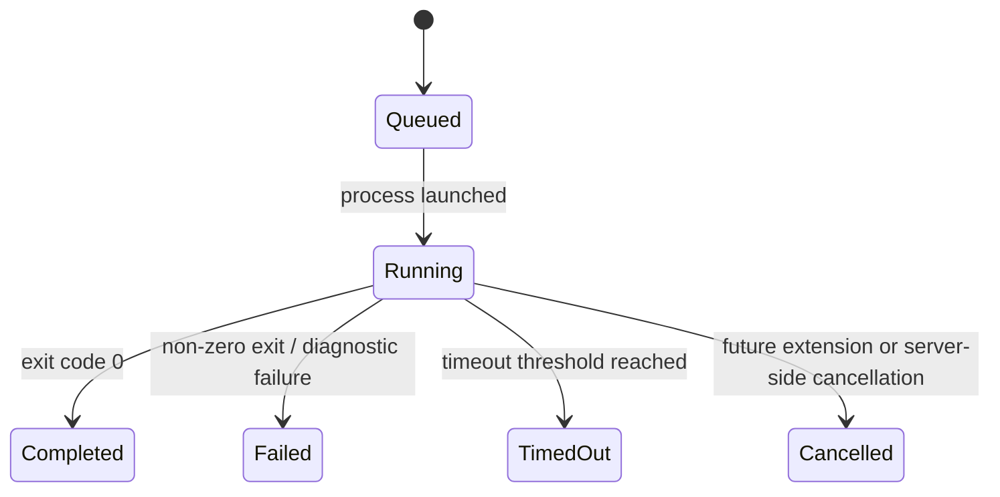
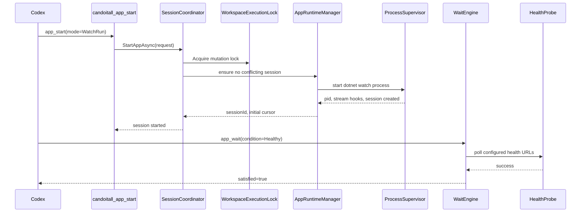
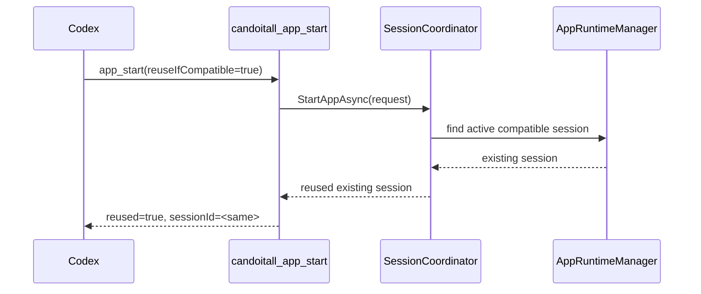
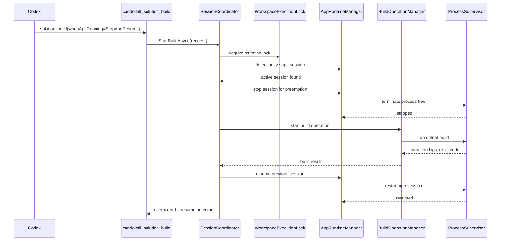
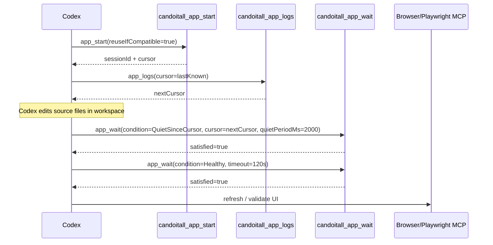
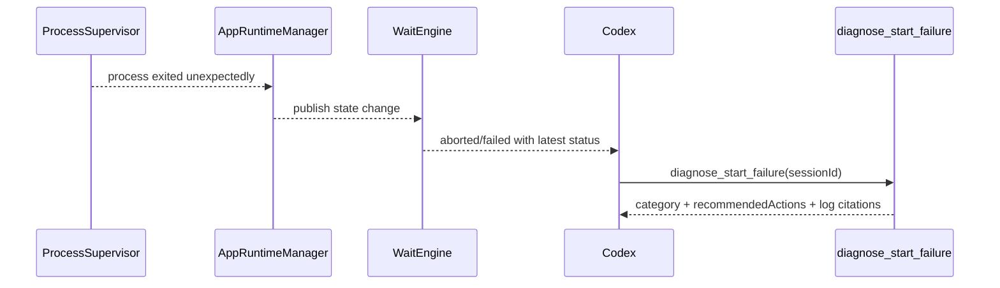
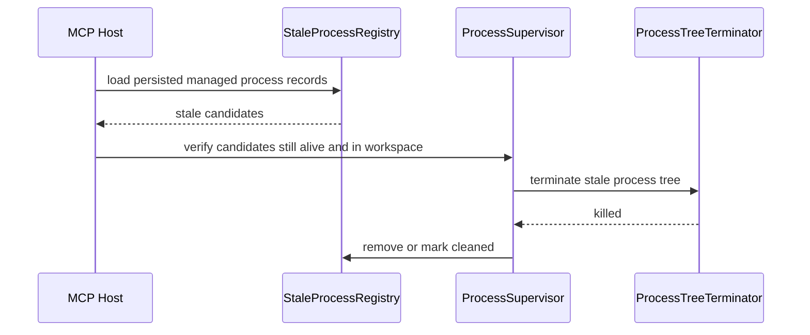

# Stavové automaty a sekvence

## 1. App session state machine

## 2. Operation state machine

## 3. Mutating workspace lock

Na jednom workspace smí být najednou nejvýše jedna mutující operace:

- `app_start`
- `app_stop`
- `solution_build`
- `tests_run`
- `cleanup_stale_processes`

Read-only operace mohou běžet souběžně:

- `workspace_info`
- `app_status`
- `app_logs`
- `operation_status`
- `operation_logs`
- `diagnose_start_failure`

`app_wait` a `operation_wait` jsou logicky read-heavy, ale interně si sahají na stav.  
Nemají brát mutation lock na celý svůj runtime, jen číst konzistentní snapshoty.

## 4. Sekvence – první start aplikace

## 5. Sekvence – idempotentní start

## 6. Sekvence – build při běžící watch session

## 7. Sekvence – testy při běžící app session

Stejný princip jako build, pouze runner je `dotnet test` a response nese test summary.

## 8. Sekvence – UI edit loop

Cílový opakovatelný flow pro Codex:

## 9. Sekvence – recovery po neočekávaném exit

## 10. Sekvence – cleanup stale procesů po restartu serveru

## 11. Eventy, které musí jít zapisovat do log bufferu

Minimální katalog systémových událostí:

- `SessionCreated`
- `SessionReused`
- `SessionStateChanged`
- `SessionStopped`
- `SessionExitedUnexpectedly`
- `OperationQueued`
- `OperationStarted`
- `OperationCompleted`
- `OperationFailed`
- `OperationTimedOut`
- `HealthProbeSucceeded`
- `HealthProbeFailed`
- `CleanupStarted`
- `CleanupKilledProcess`
- `CleanupSkippedProcess`
- `DiagnosticsProduced`

Tyto eventy mohou být ukládány jako standardní log entries s polem `eventType`.

## 12. Specifika watch restartů

`dotnet watch` může:
- provést hot reload bez plného restartu,
- v některých případech vynutit restart,
- při rude edit vyžadovat rozhodnutí o restartu.

Pro server to znamená:

- Session může zůstat stejná, ale `sessionVersion` se zvýší.
- `QuietSinceCursor` musí být navázáno na logovou aktivitu, ne jen na PID.
- `Healthy` je samostatná podmínka; restart bez healthy není úspěšný loop.

## 13. Doporučené interní invariants

Tyto invariants by měly být vyjádřeny testy:

1. V jednom workspace není více než jedna aktivní managed app session.
2. Každá log entry má monotónní `Sequence`.
3. Každá mutující operace má držitele workspace mutation locku.
4. `app_stop` vždy končí stavem `Stopped` nebo explicitní chybou.
5. `operation_wait` nikdy netvrdí `Completed`, pokud `operation_status` je stále `Running`.
6. `diagnose_start_failure` nic nespouští ani nemění stav.
