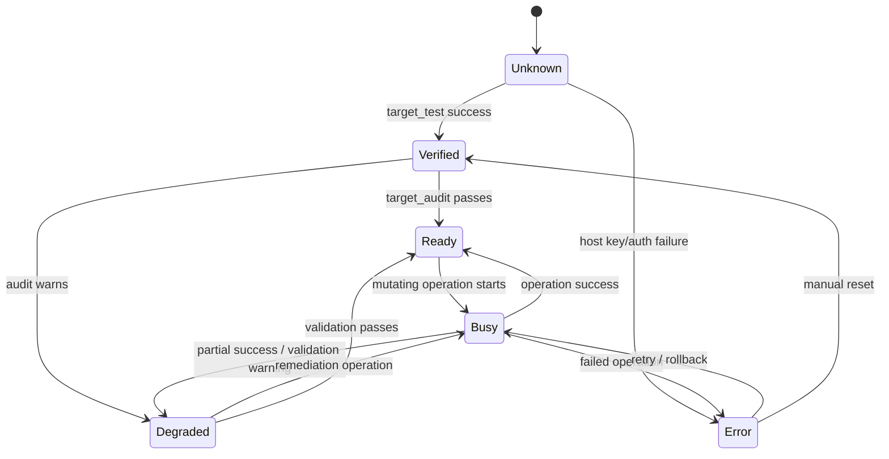
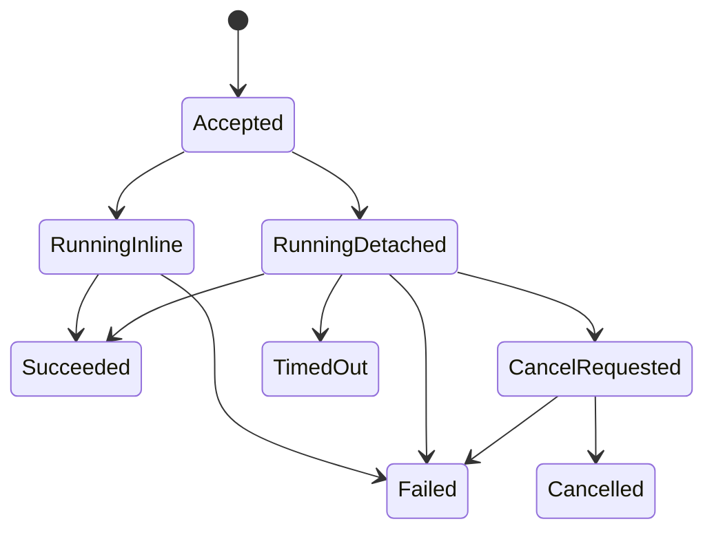
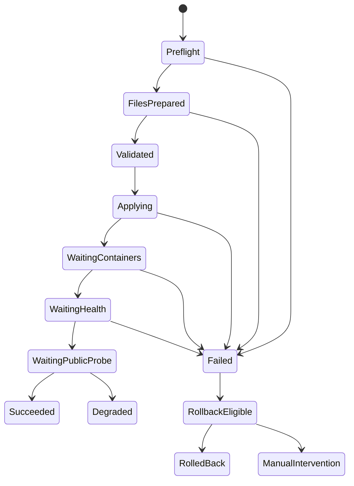
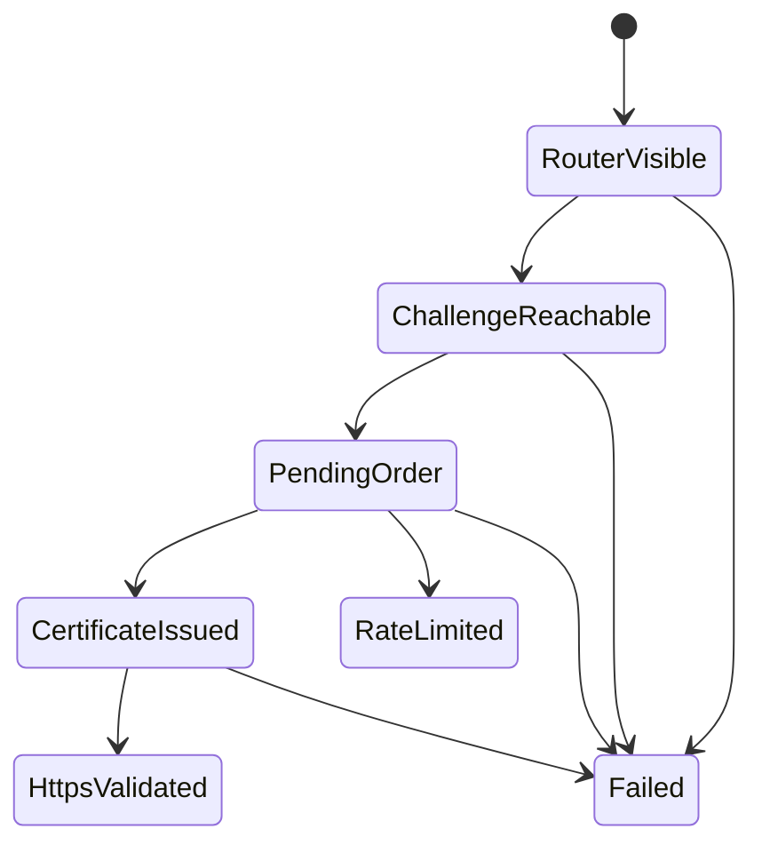
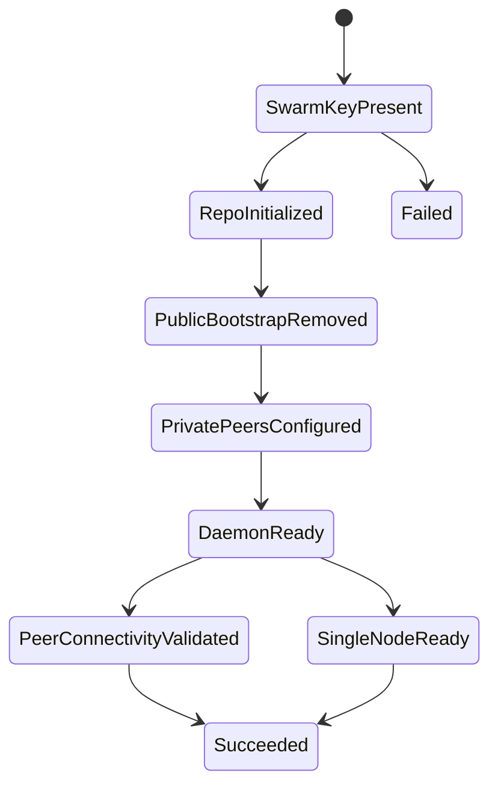
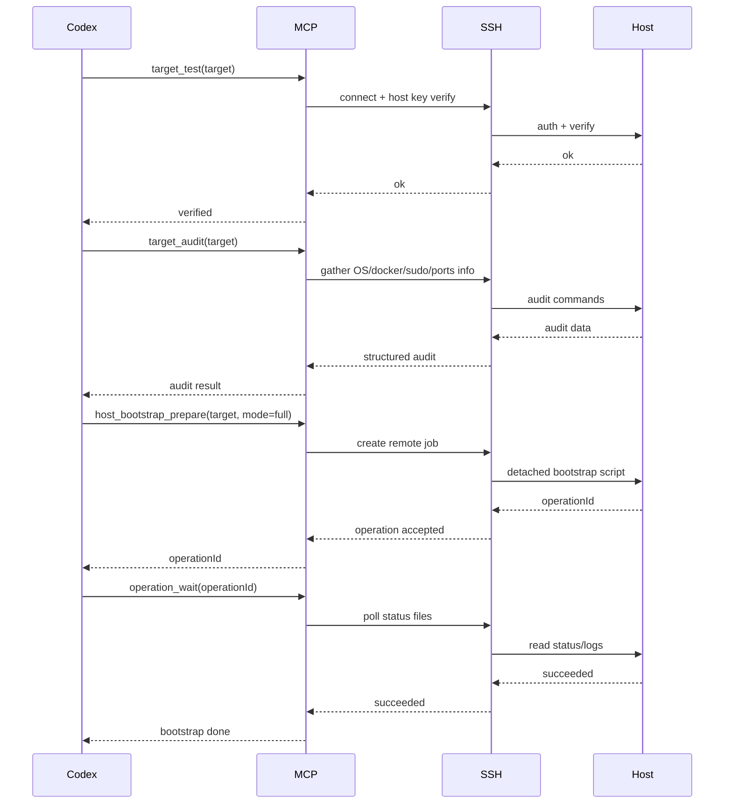
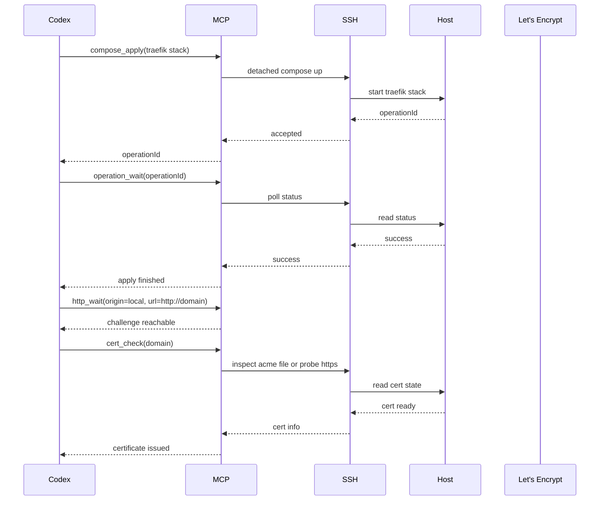
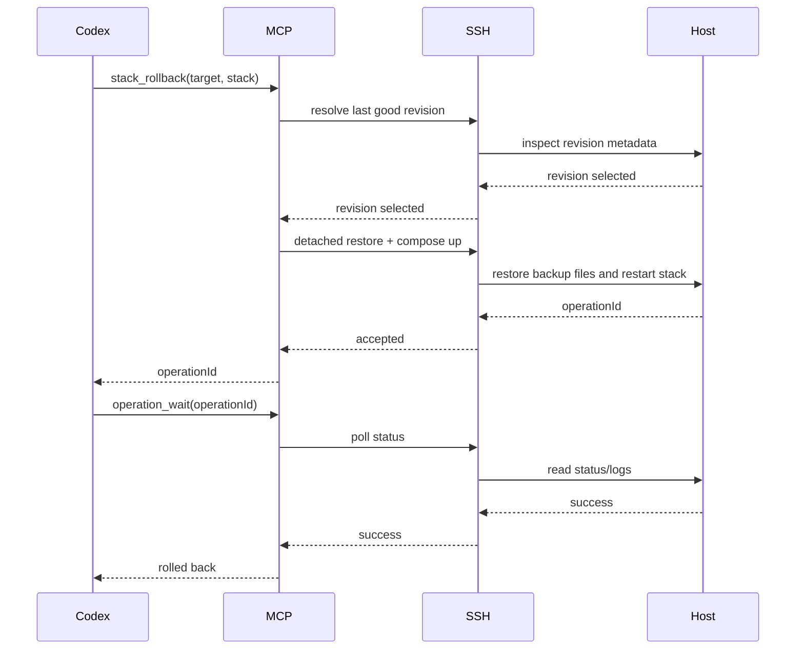

# Stavové automaty a sekvence

## 1. Target state machine

## 2. Operation state machine

## 3. Stack deployment state machine

## 4. ACME issuance state machine

## 5. IPFS private swarm state machine

## 6. Sekvence – první bootstrap hostu

## 7. Sekvence – deploy aplikačního stacku

1. `fs_apply_bundle`
   - zapíše compose artefakty,
   - případně udělá backup předchozí verze.

2. `compose_validate`
   - spustí `docker compose config`,
   - odhalí syntaktické chyby, chybějící env proměnné nebo špatné merge.

3. `docker_network_ensure`
   - zajistí existenci `proxy` a případně dalších sítí.

4. `compose_apply`
   - spustí detached job pro `docker compose up -d --remove-orphans`,
   - vrátí `operationId`.

5. `operation_wait`
   - čeká na dokončení remote jobu.

6. `compose_ps`
   - přečte stav služeb.

7. `http_wait`
   - ověří interní health appky.

8. `postgres_ready`
   - ověří DB readiness.

9. `ipfs_status` + `ipfs_private_validate`
   - ověří Kubo daemon a privátní konfiguraci.

10. `http_wait(origin=local)`
   - ověří veřejnou doménu přes Traefik.

## 8. Sekvence – Traefik + certifikát

## 9. Sekvence – IPFS private swarm init

### Single-host režim
- `swarm.key` je přítomný,
- Kubo repo je inicializované,
- bootstrap list neobsahuje veřejné bootstrap peers,
- Kubo API je přístupné pouze interně,
- veřejný swarm port 4001 nemusí být publikovaný.

### Multi-host privátní swarm
- `swarm.key` je shodný na všech uzlech,
- default bootstrap peers jsou odstraněny,
- bootstrap list ukazuje jen na kontrolované peers,
- 4001 TCP/UDP je routovatelný mezi uzly,
- volitelně je nastaven `AppendAnnounce`.

## 10. Sekvence – rollback

## 11. Důležité provozní pravidlo

Každá sekvence s mutací hostu musí končit jedním z těchto stavů:

- `Succeeded`
- `SucceededWithWarnings`
- `FailedRollbackRecommended`
- `RolledBack`
- `ManualInterventionRequired`

Nikdy ne „možná je to hotové“.  
To je pro Codex rozhodovací past a vede k chaosu.
