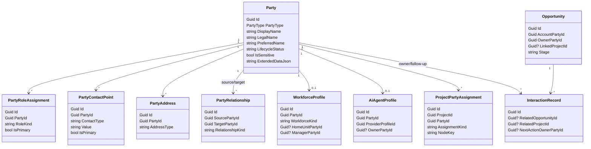

# Data model design

## 1. Persistence strategy

- Use normal EF Core entities with repository-consistent `Guid` identifiers.
- Prefix tables with `CrmHr_` for clarity.
- Keep stable relational tables for the important first-class concepts.
- Add targeted `ExtendedDataJson` fields where future customization is likely.
- Favor **archive / lifecycle flags** over destructive deletion.

## 2. Core entities

### `Party` → `CrmHr_Parties`

Purpose: shared identity root for person, organization, organization unit, and AI agent.

Suggested key fields:

- `Id`
- `PartyType` (`Person`, `Organization`, `OrganizationUnit`, `AiAgent`)
- `LifecycleStatus` (`Draft`, `Active`, `Inactive`, `Archived`, `Former`, `Candidate`, `Prospect`)
- `DisplayName`
- `LegalName`
- `PreferredName`
- `ExternalCode`
- `Summary`
- `Notes`
- `TagsJson`
- `Region`
- `CountryCode`
- `TimeZone`
- `IsSensitive`
- `ExtendedDataJson`
- `CreatedAtUtc`
- `UpdatedAtUtc`

Indexes:

- `DisplayName`
- `(PartyType, LifecycleStatus)`
- `ExternalCode`

### `PartyRoleAssignment` → `CrmHr_PartyRoles`

Purpose: lets one party behave as multiple business roles.

Suggested fields:

- `Id`
- `PartyId`
- `RoleKind` (`Customer`, `CustomerContact`, `Partner`, `Vendor`, `Employee`, `Contractor`, `Freelancer`, `DeliveryUnit`, `Candidate`, `AiSteward`, `AccountManager`, `Recruiter`, `Stakeholder`)
- `Title`
- `IsPrimary`
- `ValidFromUtc`
- `ValidToUtc`
- `Notes`

### `PartyContactPoint` → `CrmHr_PartyContactPoints`

Purpose: structured contact methods.

Suggested fields:

- `Id`
- `PartyId`
- `ContactType` (`Email`, `Phone`, `Website`, `Messaging`, `Social`, `Other`)
- `Label`
- `Value`
- `NormalizedValue`
- `IsPrimary`
- `IsPublic`
- `Notes`

Indexes:

- `NormalizedValue`
- `(PartyId, IsPrimary)`

### `PartyAddress` → `CrmHr_PartyAddresses`

Purpose: work, billing, legal, shipping, and other addresses.

Suggested fields:

- `Id`
- `PartyId`
- `AddressType`
- `Line1`
- `Line2`
- `City`
- `Region`
- `PostalCode`
- `CountryCode`
- `IsPrimary`
- `Notes`

### `PartyRelationship` → `CrmHr_PartyRelationships`

Purpose: org structure, manager chain, company links, and relationship graph.

Suggested fields:

- `Id`
- `SourcePartyId`
- `TargetPartyId`
- `RelationshipKind` (`MemberOf`, `PartOf`, `ReportsTo`, `CustomerOf`, `PartnerOf`, `VendorTo`, `Represents`, `ManagedBy`, `OwnedBy`, `Supports`)
- `IsPrimary`
- `StartDateUtc`
- `EndDateUtc`
- `Notes`

Indexes:

- `(SourcePartyId, TargetPartyId, RelationshipKind)`
- `TargetPartyId`

## 3. CRM entities

### `InteractionRecord` → `CrmHr_Interactions`

Purpose: meetings, calls, emails, messages, notes, and follow-up records.

Suggested fields:

- `Id`
- `InteractionType` (`Meeting`, `Call`, `Email`, `Message`, `Note`)
- `Subject`
- `OccurredAtUtc`
- `Summary`
- `Notes`
- `NextActionText`
- `NextActionOwnerPartyId`
- `NextActionDueUtc`
- `RelatedOpportunityId`
- `RelatedProjectId`
- `CreatedAtUtc`
- `UpdatedAtUtc`

### `InteractionPartyLink` → `CrmHr_InteractionParties`

Purpose: links one interaction to many participating or referenced parties.

Suggested fields:

- `Id`
- `InteractionId`
- `PartyId`
- `Role` (`Author`, `Account`, `Contact`, `Attendee`, `Recipient`, `Stakeholder`)

### `Opportunity` → `CrmHr_Opportunities`

Purpose: pipeline and forecastable commercial work.

Suggested fields:

- `Id`
- `Title`
- `Stage`
- `RelationshipStage`
- `AccountPartyId`
- `OwnerPartyId`
- `DeliveryUnitPartyId`
- `LinkedProjectId`
- `CurrencyCode`
- `Amount`
- `ProbabilityPercent`
- `ExpectedCloseDateUtc`
- `OpportunitySource` (`Direct`, `Partner`, `Renewal`, `Upsell`)
- `LostReason`
- `Summary`
- `Notes`
- `ExtendedDataJson`
- `CreatedAtUtc`
- `UpdatedAtUtc`

Indexes:

- `Stage`
- `OwnerPartyId`
- `AccountPartyId`
- `LinkedProjectId`

### `OpportunityPartyLink` → `CrmHr_OpportunityParties`

Purpose: extra participants in pursuit structure.

Suggested fields:

- `Id`
- `OpportunityId`
- `PartyId`
- `Role` (`Customer`, `Partner`, `Sponsor`, `TechnicalContact`, `BillingContact`, `DeliveryLead`, `Stakeholder`)

### `OpportunityStageHistory` → `CrmHr_OpportunityStageHistory`

Purpose: forecast movement and stagnation review.

Suggested fields:

- `Id`
- `OpportunityId`
- `Stage`
- `ChangedAtUtc`
- `ChangedBy`
- `Notes`

## 4. HR entities

### `WorkforceProfile` → `CrmHr_WorkforceProfiles`

Purpose: HR/staffing profile for people and delivery units.

Suggested fields:

- `Id`
- `PartyId`
- `WorkforceKind` (`Employee`, `Contractor`, `Freelancer`, `DeliveryUnit`)
- `EmployeeCode`
- `JobTitle`
- `Discipline`
- `Seniority`
- `HomeUnitPartyId`
- `ManagerPartyId`
- `StartDateUtc`
- `EndDateUtc`
- `Location`
- `TimeZone`
- `InternalCostRate`
- `ExternalBillingRate`
- `CapacityHoursPerWeek`
- `Status`
- `ExtendedDataJson`
- `Notes`

Indexes:

- `PartyId`
- `HomeUnitPartyId`
- `ManagerPartyId`
- `Status`

### `SkillDefinition` → `CrmHr_Skills`

Purpose: reusable skill dictionary.

Suggested fields:

- `Id`
- `Name`
- `Category`
- `Description`
- `IsActive`

### `PartySkill` → `CrmHr_PartySkills`

Purpose: skill membership and proficiency.

Suggested fields:

- `Id`
- `PartyId`
- `SkillId`
- `Proficiency` (`Basic`, `Working`, `Strong`, `Expert`)
- `YearsExperience`
- `CertificationStatus`
- `LastValidatedAtUtc`
- `Notes`

### `CapacityBlock` → `CrmHr_CapacityBlocks`

Purpose: time windows that affect availability.

Suggested fields:

- `Id`
- `PartyId`
- `BlockKind` (`Leave`, `Unavailable`, `Reserve`, `Tentative`)
- `StartDateUtc`
- `EndDateUtc`
- `Percentage`
- `RelatedProjectId`
- `Notes`

### `StaffingRequest` → `CrmHr_StaffingRequests`

Purpose: structured demand from projects or teams.

Suggested fields:

- `Id`
- `ProjectId`
- `RequestedByPartyId`
- `DeliveryUnitPartyId`
- `Title`
- `NeededRole`
- `NeededSkillsJson`
- `StartDateUtc`
- `EndDateUtc`
- `AllocationPercent`
- `Status`
- `Notes`

## 5. Recruiting and lifecycle entities

### `RecruitmentApplication` → `CrmHr_RecruitmentApplications`

Suggested fields:

- `Id`
- `PartyId`
- `TargetUnitPartyId`
- `RecruiterPartyId`
- `HiringManagerPartyId`
- `DesiredRole`
- `Source`
- `Stage`
- `AvailableFromUtc`
- `Decision`
- `Notes`
- `CreatedAtUtc`
- `UpdatedAtUtc`

### `RecruitmentInterview` → `CrmHr_RecruitmentInterviews`

Suggested fields:

- `Id`
- `ApplicationId`
- `ScheduledAtUtc`
- `InterviewType`
- `InterviewerPartyId`
- `Outcome`
- `Feedback`
- `Recommendation`

### `OnboardingTask` → `CrmHr_OnboardingTasks`

Suggested fields:

- `Id`
- `PartyId`
- `TaskKind` (`Onboarding`, `Offboarding`)
- `Title`
- `OwnerPartyId`
- `DueDateUtc`
- `Status`
- `Notes`
- `RelatedProjectId`

## 6. AI-agent entity

### `AiAgentProfile` → `CrmHr_AiAgentProfiles`

Purpose: business/governance profile bound to a shared AI party.

Suggested fields:

- `Id`
- `PartyId`
- `ProviderProfileId`
- `DefaultModel`
- `ExecutionMode` (`Local`, `Remote`, `ThirdParty`)
- `OwnerPartyId`
- `CapabilityJson`
- `ValidationStatus`
- `LastReviewedAtUtc`
- `Notes`
- `ExtendedDataJson`

Indexes:

- `PartyId`
- `ProviderProfileId`

## 7. Project-integration entity

### `ProjectPartyAssignment` → `CrmHr_ProjectPartyAssignments`

Purpose: reusable link between projects, parties, and optional workbench scope.

Suggested fields:

- `Id`
- `ProjectId`
- `PartyId`
- `AssignmentKind` (`Customer`, `CustomerContact`, `DeliveryUnit`, `TeamMember`, `Manager`, `Partner`, `Vendor`, `Stakeholder`, `MeetingParticipant`, `WorkItemAssignee`, `Reviewer`, `AiAgent`, `BillingContact`, `TechnicalContact`)
- `NodeKey`
- `PhaseName`
- `OpportunityId`
- `AllocationPercent`
- `StartsAtUtc`
- `EndsAtUtc`
- `IsPrimary`
- `Source`
- `Notes`

Indexes:

- `(ProjectId, PartyId, AssignmentKind, NodeKey)`
- `ProjectId`
- `PartyId`
- `OpportunityId`

## 8. Privacy / audit entities

### `PartyConfidentialNote` → `CrmHr_ConfidentialNotes`

Purpose: HR-sensitive notes excluded from general search.

Suggested fields:

- `Id`
- `PartyId`
- `Category`
- `NoteText`
- `CreatedBy`
- `CreatedAtUtc`
- `UpdatedAtUtc`

### `CrmHrAuditEntry` → `CrmHr_AuditEntries`

Purpose: technical/business audit trail for important changes.

Suggested fields:

- `Id`
- `EntityType`
- `EntityId`
- `Action`
- `Summary`
- `DetailJson`
- `Actor`
- `IsSensitive`
- `CreatedAtUtc`

## 9. Workbench metadata additions

Recommended backward-compatible additions:

### `ProjectParticipantMetadata`

Add:

- `Guid? PartyId`
- `bool IsProjectLocalOnly`

### `ProjectMeetingMetadata`

Add:

- `List<Guid> PartyIds`  
  Keeps stable central links while existing participant-node artifact ids remain usable for canvas semantics.

### `ProjectWorkItemMetadata`

Add:

- `Guid? AssigneePartyId`

## 10. Project summary enrichment

The plan intentionally avoids bloating the `Project` table with many new direct foreign keys. Instead:

- use `ProjectPartyAssignment` for reusable relationships,
- calculate primary customer / delivery unit / owner summary fields in project queries,
- optionally materialize a lightweight view model for the Projects page.

## 11. Suggested EF / schema initializer responsibilities

`CrmHrSchemaInitializer.EnsureAsync(dbContext)` should:

- ensure any seed tables or default lookup rows exist,
- seed default opportunity stages,
- seed default relationship stage choices,
- seed basic assignment kinds if stored as rows rather than enums,
- remain idempotent.

## 12. Mermaid class view

## 13. Data-model success test

The model is considered adequate only if all of these are possible without hacks:

- one company can be both customer and delivery unit,
- one person can be employee and customer stakeholder,
- one AI agent can be assigned to a project and linked to a provider profile,
- a meeting can reference real parties,
- a project can show customer / partner / delivery unit / owner / AI agent summary,
- staffing allocations can influence capacity views,
- duplicate merge can consolidate history instead of orphaning it.
