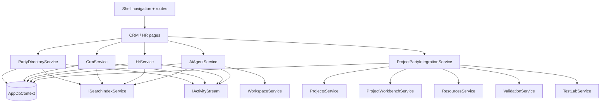

# Target architecture

## 1. Module naming and boundary

The new module is explicitly named **`CanDoItAll.Modules.CrmHr`** so its purpose is obvious in the solution explorer and startup wiring.

Inside that module, the domain is intentionally modeled around a **unified Party aggregate**. CRM, HR, AI-agent, and project-assignment views are different slices of the same identity graph.

## 2. Architectural principles

1. **Party first**  
   Every reusable actor begins as a `Party`.

2. **Roles, relationships, and profiles add context**  
   A party becomes a customer, partner, employee, contractor, delivery unit, candidate, or AI agent through role assignments, profile records, and relationships.

3. **Projects stay project-first**  
   Projects and Workbench keep their current structure-oriented model, but reference central parties through assignments and projection metadata.

4. **Reuse existing platform services**  
   Search, activity, projects, workbench, resources, workspace provider profiles, validation, test lab, and automation remain shared platform services.

5. **BaseLib UI only**  
   CRM/HR pages are list/detail, card, and tab layouts. No canvas surfaces.

## 3. High-level module structure

```text
src/
  CanDoItAll.Modules.CrmHr/
    CrmHrModuleServiceCollectionExtensions.cs
    CrmHrSchemaInitializer.cs
    Domain/
      PartyModels.cs
      CrmModels.cs
      HrModels.cs
      AiAgentModels.cs
      ProjectPartyIntegrationModels.cs
      AuditModels.cs
    Services/
      PartyDirectoryService.cs
      CrmService.cs
      HrService.cs
      AiAgentService.cs
      ProjectPartyIntegrationService.cs
    Components/
      CrmHrSecondaryTabs.razor
      PartyPicker.razor
      ... other BaseLib-first editors/panels ...
    Pages/
      CrmHrHomePage.razor
      CrmHrDirectoryPage.razor
      CrmHrCrmPage.razor
      CrmHrWorkforcePage.razor
      CrmHrRecruitingPage.razor
      CrmHrAgentsPage.razor
      CrmHrAssignmentsPage.razor
```

## 4. Page and route topology

- `/crm-hr` — summary dashboard and launch surface
- `/crm-hr/directory` — shared party registry
- `/crm-hr/crm` — accounts, stakeholders, interactions, opportunities
- `/crm-hr/workforce` — workers, units, org structure
- `/crm-hr/recruiting` — candidates, interviews, onboarding/offboarding
- `/crm-hr/agents` — AI-agent profiles and governance
- `/crm-hr/assignments` — staffing requests, allocations, project assignments

## 5. Service boundary proposal

### `PartyDirectoryService`

Owns:

- party CRUD
- role assignments
- contact methods
- addresses
- relationships
- duplicate detection and merge
- import/export helpers
- directory list queries

### `CrmService`

Owns:

- CRM account projections
- interactions and next actions
- opportunities
- opportunity stage history
- commercial summaries
- opportunity conversion prep

### `HrService`

Owns:

- workforce profiles
- skills and certifications
- availability / capacity blocks
- staffing requests
- recruitment applications and interviews
- onboarding/offboarding tasks

### `AiAgentService`

Owns:

- AI-agent profile CRUD
- provider-profile binding
- capability metadata
- stewardship and review state

### `ProjectPartyIntegrationService`

Owns:

- project-level party assignments
- Workbench participant projection / sync rules
- project summary enrichment
- project/workbench conversion helpers
- allocation feedback into workforce views

## 6. Integration topology



## 7. Why this architecture fits CanDoItAll

- It respects current modular composition in `Program.cs` and `ModuleAssemblies.cs`.
- It respects the app’s existing pattern of service-per-module-area rather than building a giant god-service.
- It keeps project-structure authoring in Workbench instead of moving Workbench concepts into the CRM/HR module.
- It uses the platform’s existing search and activity infrastructure.
- It uses `Workspace` for runtime AI settings instead of duplicating provider configuration.
- It keeps the CRM/HR UI in the same style family as Projects and Resources.

## 8. Architectural decisions locked by this bundle

### AD-01 — One Party root

A real-world actor must be represented once and then reused through roles, relationships, and profiles.

### AD-02 — Workbench participants are projections, not orphans

Project participants remain valid nodes and workflows, but they should reference central parties when applicable.

### AD-03 — Opportunity handoff becomes a formal flow

When an opportunity is won, conversion to project context should preserve customer, partner, delivery unit, sponsor, and ownership data.

### AD-04 — Workforce and project assignments must reconcile

Project allocations must influence HR/staffing views; otherwise HR remains disconnected from delivery reality.

### AD-05 — AI agents are governed actors

An AI agent is not just a provider profile and not just a Workbench node. It needs shared identity, ownership, capability notes, and review status.

### AD-06 — Sensitive data is partitioned

Not every CRM/HR note belongs in global search or broad list summaries. Confidential data handling is part of the architecture, not a later polish item.

## 9. Success criteria

This architecture is considered correct only if it enables all of these simultaneously:

- account/contact CRM flows,
- workforce and staffing flows,
- recruitment lifecycle,
- AI-agent governance,
- project/workbench assignment flows,
- search/activity visibility,
- privacy/audit controls,
- and Playwright-validated BaseLib UI surfaces.
