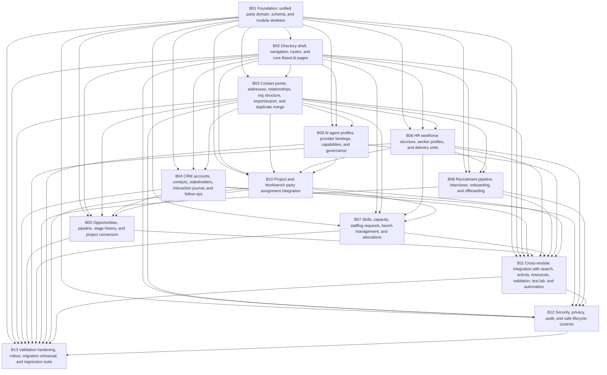

# Dependency map

## Bundle dependency graph

## Dependency table

| Bundle | Depends on | Blocks |
| --- | --- | --- |
| B01 | None | B02, B03, B04, B05, B06, B07, B08, B09, B10, B11, B12, B13 |
| B02 | B01 | B03, B04, B05, B06, B07, B08, B09, B10, B11, B12, B13 |
| B03 | B01, B02 | B04, B05, B06, B07, B08, B09, B10, B11, B12, B13 |
| B04 | B01, B02, B03 | B05, B11, B12, B13 |
| B05 | B01, B02, B03, B04, B10 | B11, B13 |
| B06 | B01, B02, B03 | B07, B08, B10, B11, B12, B13 |
| B07 | B01, B02, B03, B06, B10 | B11, B13 |
| B08 | B01, B02, B03, B06 | B11, B12, B13 |
| B09 | B01, B02, B03 | B10, B11, B13 |
| B10 | B01, B02, B03, B06, B09 | B05, B07, B11, B13 |
| B11 | B01, B02, B03, B04, B05, B06, B07, B08, B09, B10 | B12, B13 |
| B12 | B01, B02, B03, B04, B06, B08, B11 | B13 |
| B13 | B01, B02, B03, B04, B05, B06, B07, B08, B09, B10, B11, B12 | None |

## Critical path

The most important dependency chain is:

`B01 -> B02 -> B03 -> B10 -> B05 -> B11 -> B12 -> B13`

Why:

- B01/B02 create the module and route surface.
- B03 makes the directory actually usable.
- B10 integrates the new identity model with Projects and Workbench.
- B05 depends on real project conversion semantics.
- B11/B12/B13 complete cross-module wiring, privacy hardening, and final proof.

## Parallelization guidance

Safe parallel groups:

- `B03`, `B06`, `B09`
- later `B05`, `B07`, `B08` after their dependencies are satisfied

Avoid parallelizing:

- B10 before B03/B06/B09 are stable
- B13 before B11/B12 are actually done
- privacy/audit policy before the main entities exist
