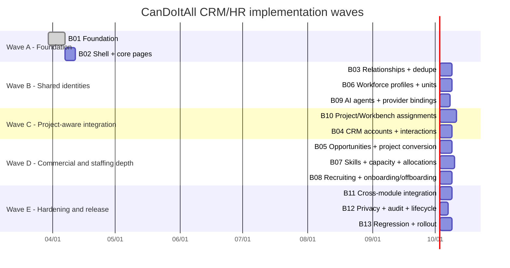

# Mermaid gantt

The chart below is a dependency-oriented execution map, not a fixed contractual schedule. Dates are illustrative and start from the week after bundle creation.

## Reading notes

- B03, B06, and B09 can proceed in parallel once the module shell and base schema exist.
- B10 is the pivotal bridge into Projects and Workbench.
- B05 and B07 intentionally wait for B10 because both need stable project-assignment semantics.
- B13 is a real work package with code, tests, evidence conventions, and rollout rehearsal.
