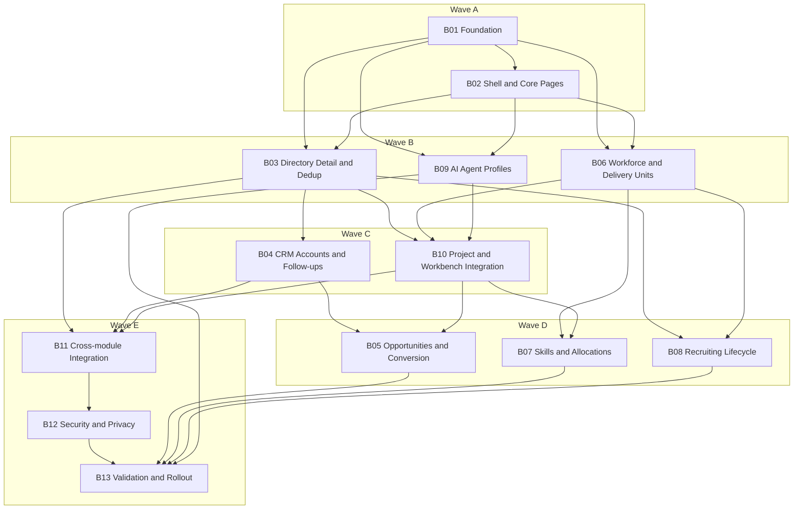

# Phase Plan

## Execution Order

1. `B01` - Foundation: unified party domain, schema, and module skeleton
2. `B02` - Directory shell, navigation, routes, and core BaseLib pages
3. `B03` - Contact points, addresses, relationships, org structure, import/export, and duplicate merge
4. `B04` - CRM accounts, contacts, stakeholders, interaction journal, and follow-ups
5. `B05` - Opportunities, pipeline, stage history, and project conversion
6. `B06` - HR workforce structure, worker profiles, and delivery units
7. `B07` - Skills, capacity, staffing requests, bench management, and allocations
8. `B08` - Recruitment pipeline, interviews, onboarding, and offboarding
9. `B09` - AI agent profiles, provider bindings, capabilities, and governance
10. `B10` - Project and Workbench party assignment integration
11. `B11` - Cross-module integration with search, activity, resources, validation, test lab, and automation
12. `B12` - Security, privacy, audit, and safe lifecycle controls
13. `B13` - Validation hardening, rollout, migration rehearsal, and regression suite

## Subbundle Dependency Map

## Critical Subbundles

- `B01` is the primary foundation for schema, module registration, and Party identity.
- `B02` is the route and shell foundation for all CRM/HR browser proof.
- `B03` hardens directory data fidelity that later CRM, HR, and project-assignment work depends on.
- `B10` is a critical integration foundation because project/workbench assignment proof depends on it.
- `B11` and `B12` validate cross-module accountability and privacy behavior that can reopen earlier work.
- `B13` is the explicit final closure and regression gate.

## Phase Gates

- Prepared gate: run `scripts/validate_bundle.py --stage prepared`, confirm bundle readiness, and repair drift before code changes.
- Entry gate before each subbundle: confirm prerequisites, source references, and prior proof still hold after repo inspection.
- Closure gate after each subbundle: record tests, builds, browser proof, analytics rows, and progression decision before moving on.
- Critical-foundation rule: require one dependent-flow smoke after `B01`, `B02`, `B03`, and `B10` before trusting downstream work.
- Final closure gate: rerun `scripts/validate_bundle.py --stage completed`, close raw notes, and reopen any phase with weak proof.
