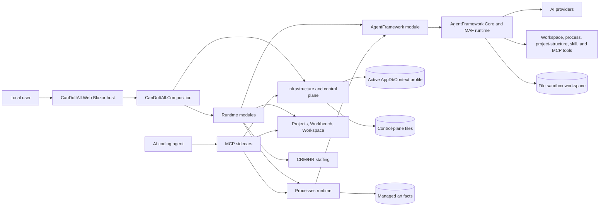

# CanDoItAll

CanDoItAll is a local-first .NET 10 Blazor Web App for project delivery work. It combines project structure, process templates and runs, workbench views, prompts, resources, validation, test evidence, activity, automation, CRM/HR staffing, and AgentFramework-backed AI agents in one workspace.

The current architecture is modular: `CanDoItAll.Web` hosts the app, `CanDoItAll.Composition` wires the runtime, `CanDoItAll.Infrastructure` owns data/storage/control-plane concerns, `CanDoItAll.Modules.*` own product behavior, `CanDoItAll.AgentFramework.*` owns technical agent execution, and `CanDoItAll.Mcp.*` exposes selected capabilities to local agents.

## Overview



## Architecture Docs

- [Architecture beta](docs/architecture-beta.md): detailed current architecture with Mermaid `architecture-beta`, C4, and sequence diagrams, including process execution with AI agents.
- [Docs index](docs/README.md): repository documentation map.
- [Architecture index](architecture/README.md): current architecture docs, ADRs, and historical architecture reviews.
- [Shared components](docs/ui-shared-components/README.md): current shared component-library split and usage guidance.

## Requirements

- .NET 10 SDK
- Windows PowerShell for local install scripts and Playwright browser install
- Node.js and npm when rebuilding the shared Tailwind output
- `git` when installing or refreshing the portable Codex skill pack

## Run The Web App

From the repo root:

```powershell
dotnet run --project src/CanDoItAll.Web
```

Runtime notes:

- The app uses Blazor Interactive Server rendering.
- Development readiness is exposed at `/_dev/runtime`.
- Development database selection is exposed at `/_dev/database/selection`.
- If no explicit `Database:Provider` and `Database:ConnectionString` override is supplied, the app resolves its active database through the control plane rooted at `%LOCALAPPDATA%\CanDoItAll\control-plane` by default.
- Managed SQLite profiles are provisioned under the active control-plane profile storage root.

## Run The Development Manager

From the repo root:

```powershell
dotnet run --project tools/CanDoItAll.Manager
```

The manager listens on `http://127.0.0.1:6407` by default. It supervises `dotnet watch` for the web app, confirms readiness through `/_dev/runtime`, exposes loopback-only watch/capsule/tuning endpoints, and writes capsule artifacts under `.artifacts/codex-capsules`.

## Test Commands

Run the full build:

```powershell
dotnet build CanDoItAll.slnx
```

Run the main test layers individually:

```powershell
dotnet test tests\CanDoItAll.Tests.Unit\CanDoItAll.Tests.Unit.csproj
dotnet test tests\CanDoItAll.Tests.Integration\CanDoItAll.Tests.Integration.csproj
dotnet test tests\CanDoItAll.Tests.Components\CanDoItAll.Tests.Components.csproj
dotnet test tests\CanDoItAll.Tests.Playwright\CanDoItAll.Tests.Playwright.csproj
```

Install Chromium for Playwright once per machine after the Playwright test project is built:

```powershell
powershell -ExecutionPolicy Bypass -File tests\CanDoItAll.Tests.Playwright\bin\Debug\net10.0\playwright.ps1 install chromium
```

## Project Families

| Family | Responsibility |
| --- | --- |
| `CanDoItAll.Web`, `CanDoItAll.Composition`, `CanDoItAll.Infrastructure`, `CanDoItAll.SharedKernel` | Host, composition, data/control-plane/storage/readiness, shared primitives. |
| `CanDoItAll.Modules.*` | Product modules for projects, processes, workbench, workspace, prompts, resources, validation, automation, CRM/HR, AgentFramework, activity, collaboration, security, and test lab. |
| `CanDoItAll.AgentFramework.*` | Technical agent catalog, provider profiles, file-backed workspaces, Microsoft Agent Framework runtime adapter, workspace tools, MCP capabilities, execution runs, artifacts, and UI components. |
| `CanDoItAll.Components.*` | Shared Razor UI primitives, canvas controls, overlay windows, WebGL workbench runtime, facade, and sandbox projects. |
| `CanDoItAll.Mcp.*` | Agent-facing adapters for code analytics, components, dotnet watch, process runtime, project structure, SSH operations, and local runtime helpers. |
| `CanDoItAll.Migrations.*` | Provider-specific EF Core migrations for SQLite and PostgreSQL. |
| `tests/*` | Unit, integration, component, Playwright, support, and MCP-focused tests. |
| `tools/*` | Local manager, dotnet-watch tray, MCP harness, RPI validation artifacts, and scenario seeding tools. |

Each tracked `.csproj` directory under `src`, `tests`, and `tools` has a local `README.md` with the project purpose, references, and validation notes.

## Process Runtime And AI Agents

Processes are durable runtime workflows. A process run materializes assignments, step runs, work briefs, artifact expectations, dependencies, decisions, journals, and outbox work. Ready steps are dispatched by `ProcessRunAutomationDispatchService`, which resolves the assigned CRM/HR AI party to a technical AgentFramework agent, builds a governed process-step prompt, executes the agent, audits required tool and evidence use, projects execution artifacts into managed storage, records process artifacts, and transitions the step.

Agent execution is handled by `CanDoItAll.AgentFramework.*`. The Microsoft Agent Framework adapter attaches permitted workspace, process, project-structure, skill, MCP, and provider-native tools. Execution state, chat sessions, tool receipts, artifacts, approvals, and metrics are persisted in the active profile's file sandbox workspace.

## Local Data

- App data lives in the active `AppDbContext` profile.
- Control-plane metadata and DataProtection keys live under `%LOCALAPPDATA%\CanDoItAll\control-plane` unless `ControlPlane:RootPath` is overridden.
- Managed artifacts are routed through infrastructure storage services.
- AgentFramework catalog, chat, execution, receipt, and artifact files live in a profile-scoped file sandbox workspace.
- Workbench browser tab state is stored in local storage under `candoitall.workbench.session`.

## Codex Skills And MCP Setup

The portable Codex skill pack is documented in [codex/README.md](codex/README.md).

Install or refresh the CanDoItAll custom skills and required public sibling skills with:

```powershell
powershell -ExecutionPolicy Bypass -File .\codex\scripts\install-candoitall-skills.ps1
```

MCP setup notes:

- [Processes MCP setup](docs/processes-mcp-setup.md)
- [Project Structure MCP setup](docs/project-structure-mcp-setup.md)
- [DotNetWatch persistent backend notes](docs/mcp-dotnetwatch-persistent-backend-benefits.md)

## Styling

Shared component styling is built through the Tailwind workspace:

```powershell
npm install
npm run tailwind:build
```

The output is written to `src/CanDoItAll.Components.BaseLib/wwwroot/css/output.css`.
